# Laporan Praktikum # 10 - Polimorfisme

## Kompetensi

1. Memahami konsep dan bentuk dasar polimorfisme
2. Memahami konsep virtual method invication
3. Menerapkan polimorfisme pada pembuatan heterogeneous collection
4. Menerapkan polimorfisme pada parameter/argument method
5. Menerapkan object casting untuk meng-ubah bentuk objek

## Ringkasan Materi

Polimorfisme merupakan kemampuan suatu objek untuk memiliki banyak
bentuk. Penggunaan polimorfisme yang paling umum dalam OOP terjadi
ketika ada referensi super class yang digunakan untuk merujuk ke objek dari
sub class. Dengan kata lain, ketika ada suatu objek yang dideklarasikan dari
super class, maka objek tersebut bisa diinstansiasi sebagai objek dari sub
class. Dari uraian tersebut bisa dilihat bahwa konsep polimorfisme bisa
diterapkan pada class-class yang memiliki relasi inheritance (relasi
generalisasi atau IS-A).
# Percobaan

## Percobaan 1 – Bentuk dasar polimorfisme

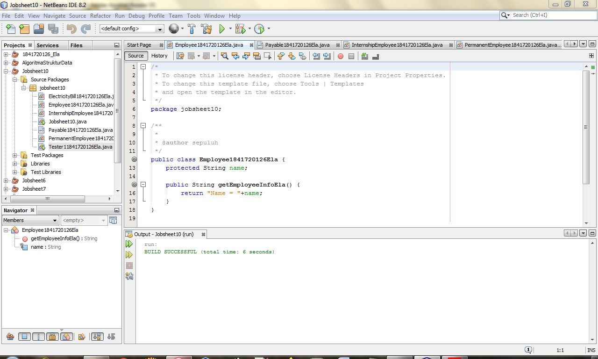
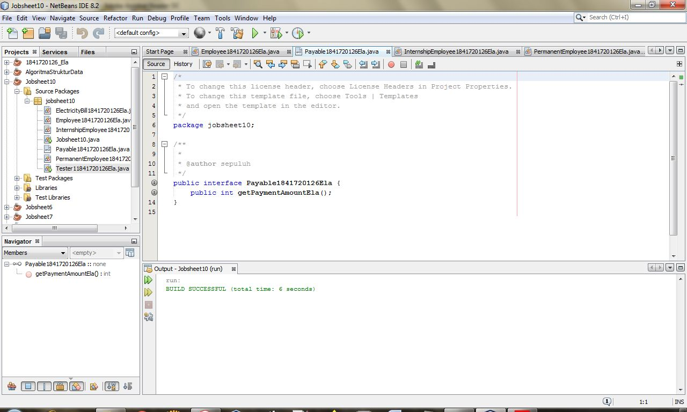
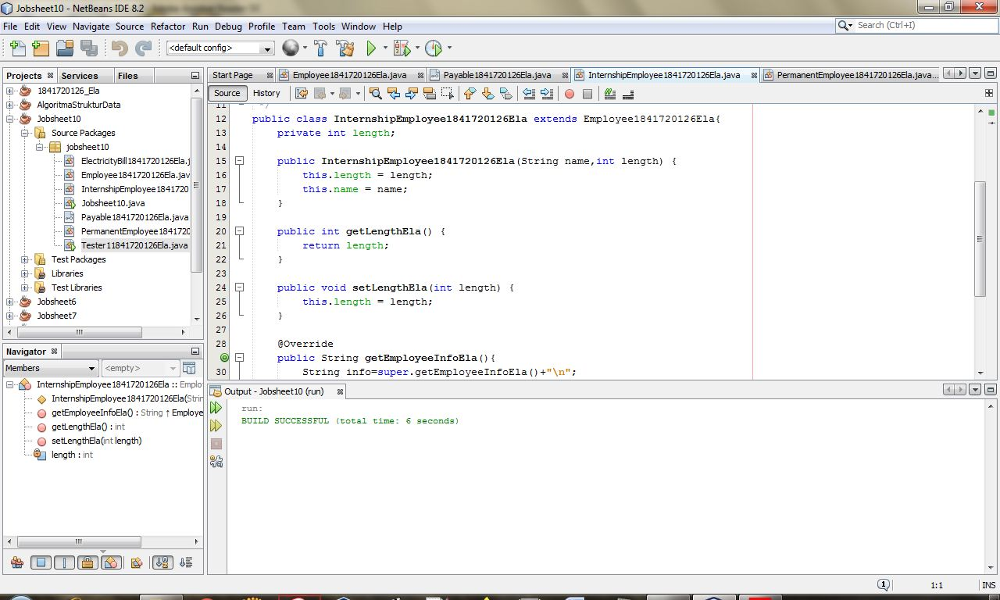

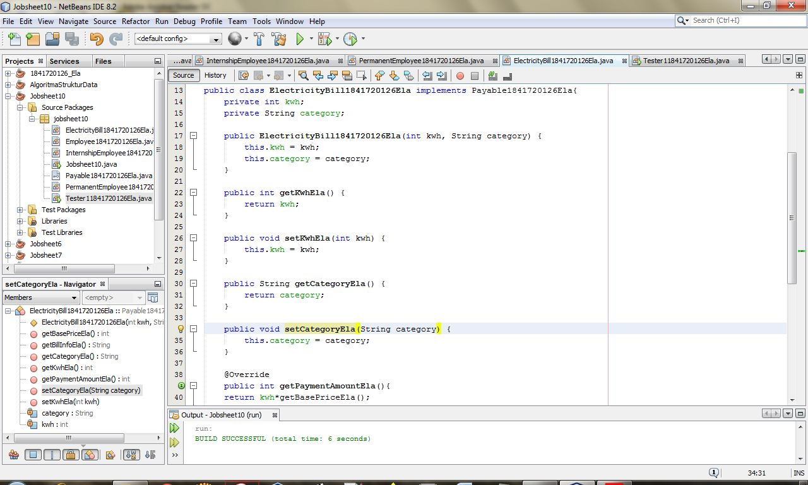
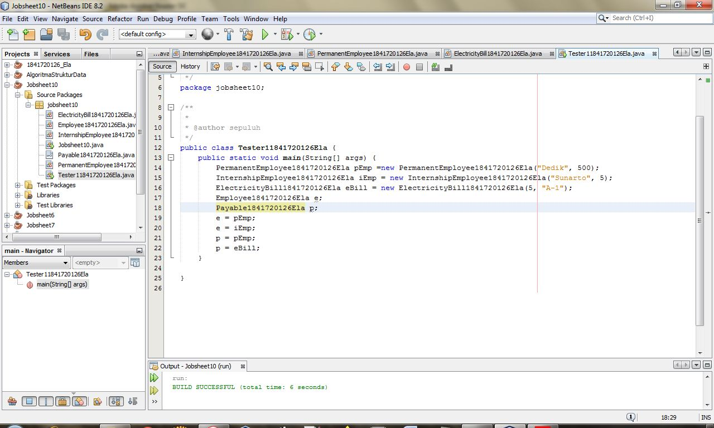

link kode program : 
[ElectricityBill1841720126Ela](../../src/10_Polimorfisme/ElectricityBill1841720126Ela.java)

link kode program : 
[Employee1841720126Ela](../../src/10_Polimorfisme/Employee1841720126Ela.java)

link kode program : 
[InternshipEmployee1841720126Ela](../../src/10_Polimorfisme/InternshipEmployee1841720126Ela.java)

link kode program : 
[Payable1841720126Ela](../../src/10_Polimorfisme/Payable1841720126Ela.java)

link kode program : 
[PermanentEmployee1841720126Ela](../../src/10_Polimorfisme/PermanentEmployee1841720126Ela.java)

link kode program : 
[Tester11841720126Ela](../../src/10_Polimorfisme/Tester11841720126Ela.java)

### Pertanyaan Percobaan 1

1. Class apa sajakah yang merupakan turunan dari class Employee?
> jawab : 
class IntershipEmployee1841720126Ela dan class PermanenrEmployee1841720126Ela

2. Class apa sajakah yang implements ke interface Payable?
> jawab : 
class PermanentEmployee1841720126Ela dan class ElectricityBill1841720126Ela 

3. Perhatikan class Tester1, baris ke-10 dan 11. Mengapa e, bisa diisi
dengan objek pEmp (merupakan objek dari class
PermanentEmployee) dan objek iEmp (merupakan objek dari class
InternshipEmploye) ?
> jawab : 
Karena merupakan turunan class Employee dimana class Employee diinstasiasi dengan objek e

4. Perhatikan class Tester1, baris ke-12 dan 13. Mengapa p, bisa diisi
dengan objek pEmp (merupakan objek dari class
PermanentEmployee) dan objek eBill (merupakan objek dari class
ElectricityBill) ?
> jawab : 
Karena class PermanentEmployee dan ElectricityBill mengimplentasi interface dari class Payable.

5. Coba tambahkan sintaks:
p = iEmp;
e = eBill;
pada baris 14 dan 15 (baris terakhir dalam method main) ! Apa yang
menyebabkan error?
> jawab : 
Karena Class PermanentEmployee dan InternshipEmployee merupakan turunan dari Class Payable.

6. Ambil kesimpulan tentang konsep/bentuk dasar polimorfisme!
> jawab : 
Polimorfisme bisa diterapkan pada class-class yang memiliki relasi inheritance dan interface. Ketika ada objek yang dideklarasikan dari suatu interface, maka ia bisa digunakan untuk mereferensikan ke objek yang mengimplements class interface tersebut.

## Percobaan 2 – Virtual method invocation

link kode program : 
[Tester21841720126Ela](../../src/10_Polimorfisme/Tester21841720126Ela.java)

### Pertanyaan Percobaan 2

1. Perhatikan class Tester2 di atas, mengapa pemanggilan
e.getEmployeeInfo() pada baris 8 dan
pEmp.getEmployeeInfo() pada baris 10 menghasilkan hasil
sama?
> jawab : 
Karena pada baris ke 7 sudah dideklarasikan bahwa object e merupakan pEmp.

2. Mengapa pemanggilan method e.getEmployeeInfo() disebut
sebagai pemanggilan method virtual (virtual method invication),
sedangkan pEmp.getEmployeeInfo() tidak?
> jawab : 
karena e merupakan method yang fungsinya untuk passing.

3. Jadi apakah yang dimaksud dari virtual method invocation? Mengapa
disebut virtual?
> jawab : 
Virtual method invocation terjadi ketika ada pemanggilan overriding method dari suatu object polimorfisme. Karena antara method yang dikenali oleh compiler dan method yang dijalankan oleh JVM berbeda.

## Percobaan 3 – Heterogenous Collection

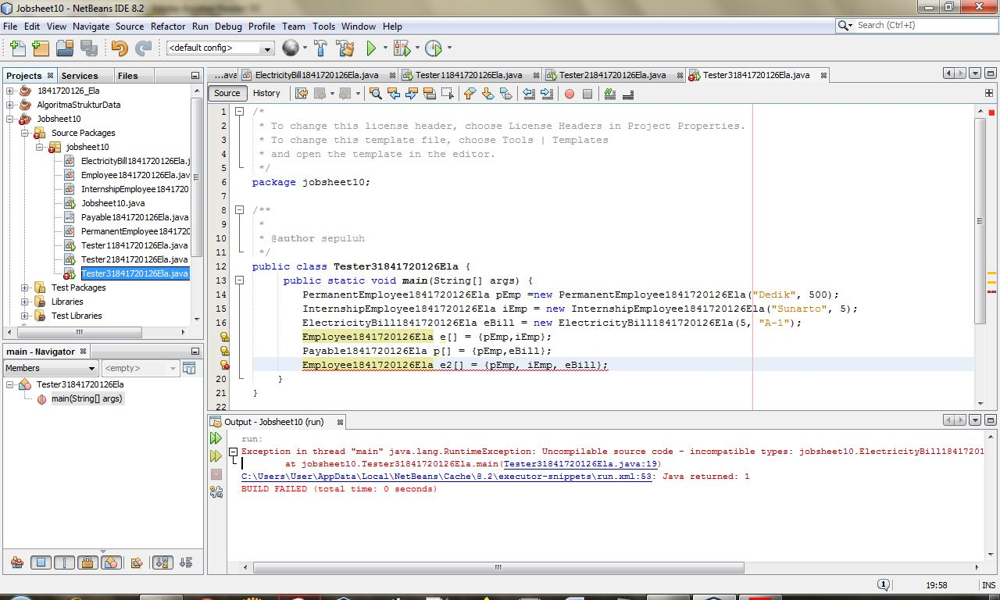

- setelah di perbaiki
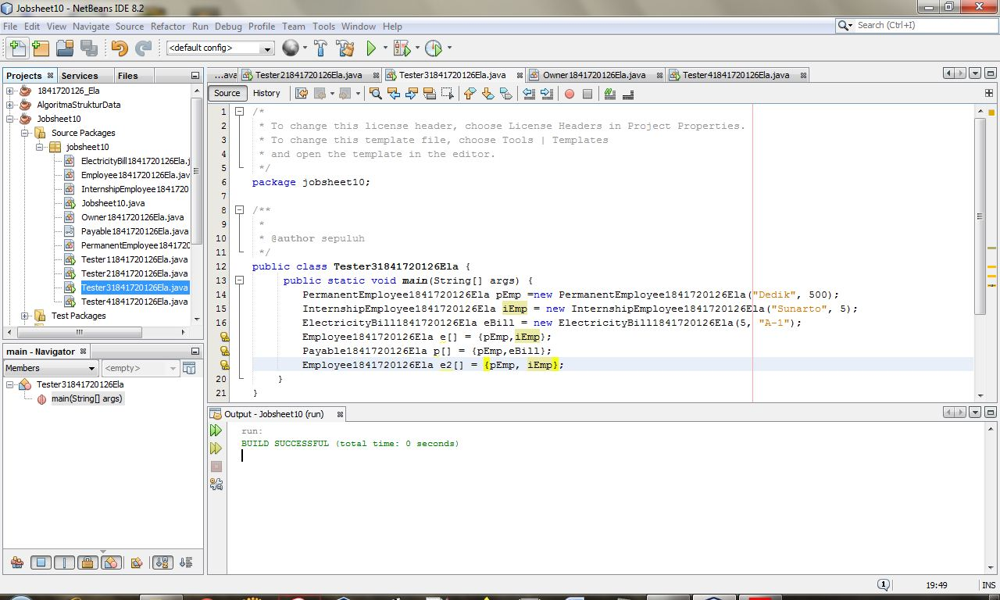

link kode program : 
[Tester31841720126Ela](../../src/10_Polimorfisme/Tester31841720126Ela.java)

### Pertanyaan Percobaan 3 

1. Perhatikan array e pada baris ke-8, mengapa ia bisa diisi dengan
objek-objek dengan tipe yang berbeda, yaitu objek pEmp (objek dari
PermanentEmployee) dan objek iEmp (objek dari
InternshipEmployee) ?
> jawab : 
karena objek pEmp dan iEmp merupakan object dari class yang merupakan turunan dari class Employee.

2. Perhatikan juga baris ke-9, mengapa array p juga biisi dengan objekobjek
dengan tipe yang berbeda, yaitu objek pEmp (objek dari
PermanentEmployee) dan objek eBill (objek dari
ElectricityBilling) ?
> jawab : 
Karena objek pEmp dan eBill merupakan object dari class yang mengimplements dari class Payable.

3. Perhatikan baris ke-10, mengapa terjadi error?
> jawab :
Karena eBill bukan termasuk Class turunan dari Class Employee. 

## Percobaan 4 – Argumen polimorfisme, instanceod dan casting objek

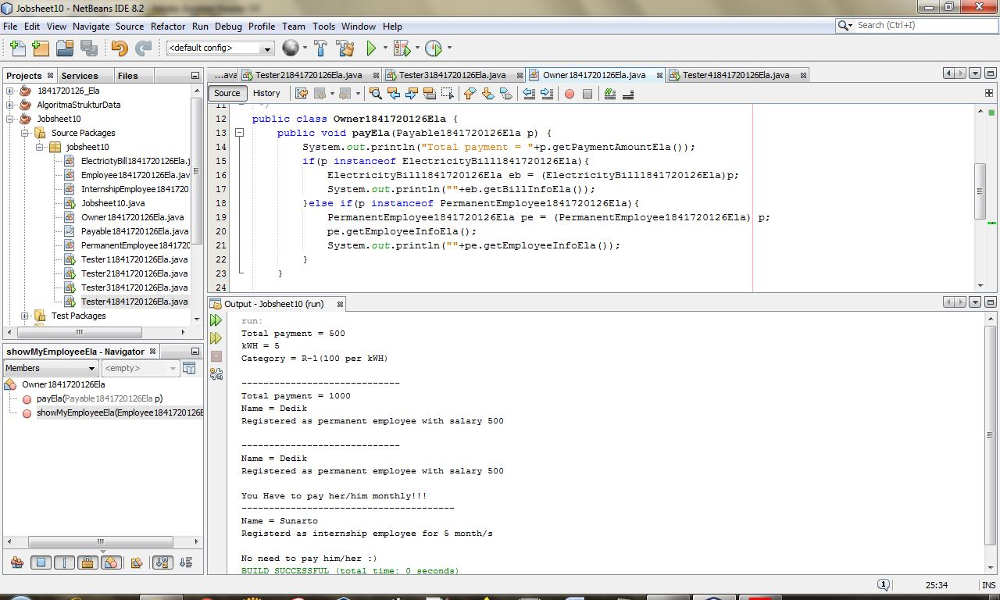
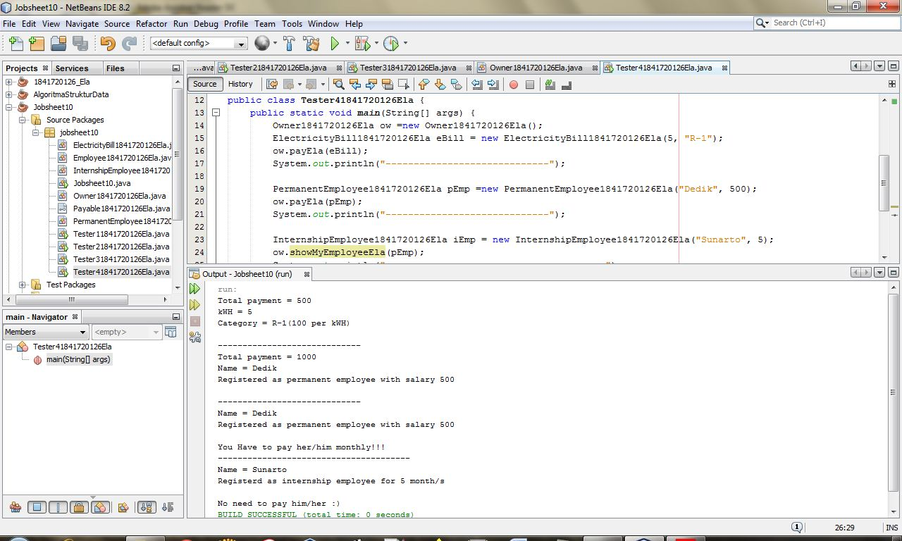

link kode program : 
[Owner1841720126Ela](../../src/10_Polimorfisme/Owner1841720126Ela.java)

link kode program : 
[Tester41841720126Ela](../../src/10_Polimorfisme/Tester41841720126Ela.java)

### Pertanyaan Percobaan 4 
1. Perhatikan class Tester4 baris ke-7 dan baris ke-11, mengapa
pemanggilan ow.pay(eBill) dan ow.pay(pEmp) bisa dilakukan,
padahal jika diperhatikan method pay() yang ada di dalam class
Owner memiliki argument/parameter bertipe Payable? Jika
diperhatikan lebih detil eBill merupakan objek dari
ElectricityBill dan pEmp merupakan objek dari
PermanentEmployee?
> jawab : 
Pada class Tester4 baris ke-7 dan baris ke-11, pemanggilan ow.pay(eBill) dan ow.pay(pEmp) bisa dilakukan, padahal jika diperhatikan method pay() yang ada di dalam class Owner memiliki argument/parameter bertipe Payable karena keduanya sama - sama mengimplementasikan interface Payable.

2. Jadi apakah tujuan membuat argument bertipe Payable pada
method pay() yang ada di dalam class Owner?
> jawab :
Tujuan membuat argument bertipe Payable pada method pay() yang ada di dalam class Owner untuk bisa memanggil method getPaymentAmount yang ada di masing – masing object yang dimasukkan sebagai parameter.

3. Coba pada baris terakhir method main() yang ada di dalam class
Tester4 ditambahkan perintah ow.pay(iEmp);
Mengapa terjadi error?
> jawab :
Eror karena iEmp tidak mengimplements class Payable.

4. Perhatikan class Owner, diperlukan untuk apakah sintaks p
instanceof ElectricityBill pada baris ke-6 ?
> jawab :
Untuk mengecek apakah object yang dimasukkan sebagai implements dari Payable atau tidak.

5. Perhatikan kembali class Owner baris ke-7, untuk apakah casting
objek disana (ElectricityBill eb = (ElectricityBill) p)
diperlukan ? Mengapa objek p yang bertipe Payable harus di-casting
ke dalam objek eb yang bertipe ElectricityBill ?
> jawab :
Untuk dikembalikan ke instan sesungguhnya sehingga dapat memanggil method getBillInfo() yang hanya ada di class ElectricityBill.

## Tugas

Dalam suatu permainan, Zombie dan Barrier bisa dihancurkan oleh Plant dan
bisa menyembuhkan diri. Terdapat dua jenis Zombie, yaitu Walking Zombie
dan Jumping Zombie. Kedua Zombie tersebut memiliki cara penyembuhan
yang berbeda, demikian juga cara penghancurannya, yaitu ditentukan oleh
aturan berikut ini:
• Pada WalkingZombie 
=>  Penyembuhan : Penyembuhan ditentukan berdasar level
zombie yang bersangkutan
-  Jika zombie level 1, maka setiap kali penyembuhan,
health akan bertambah 20%
- Jika zombie level 2, maka setiap kali penyembuhan,
health akan bertambah 30%
- Jika zombie level 3, maka setiap kali penyembuhan,
health akan bertambah 40%
=> Penghancuran : setiap kali penghancuran, health akan
berkurang 2%

• Pada Jumping Zombie  
=>  Penyembuhan : Penyembuhan ditentukan berdasar level
zombie yang bersangkutan
- Jika zombie level 1, maka setiap kali penyembuhan,
health akan bertambah 30%
- Jika zombie level 2, maka setiap kali penyembuhan,
health akan bertambah 40%
- Jika zombie level 3, maka setiap kali penyembuhan,
health akan bertambah 50%

=> Penghancuran : setiap kali penghancuran, health akan
berkurang 1%

> jawab : 
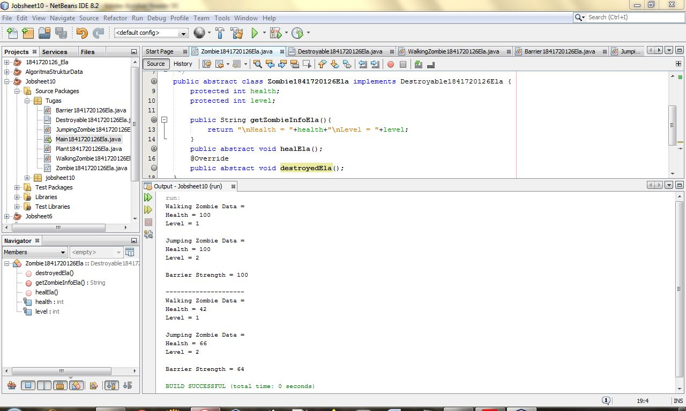
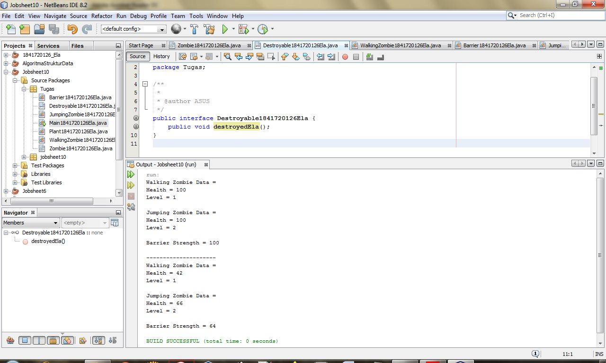
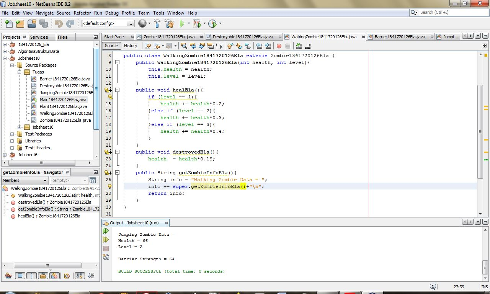
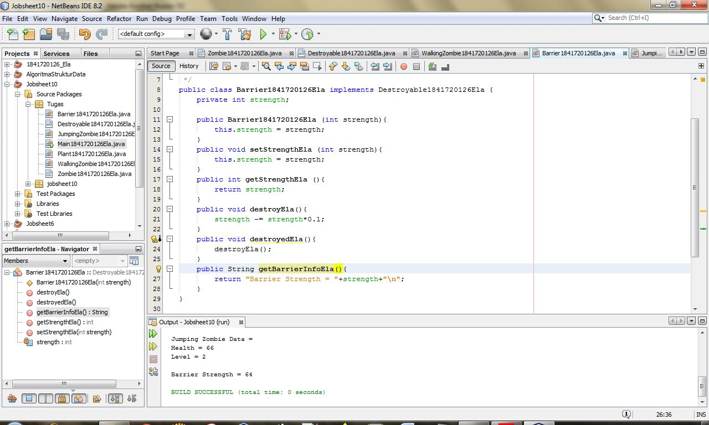
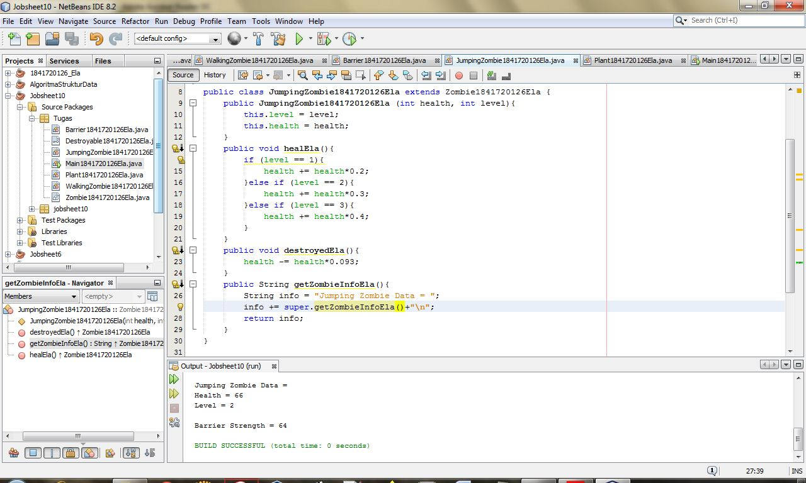
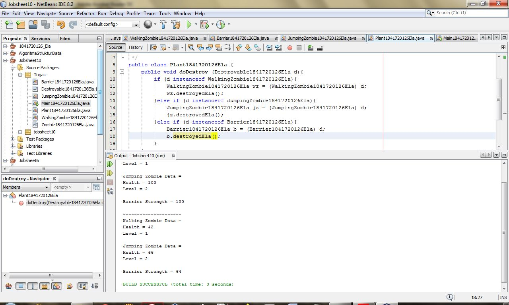
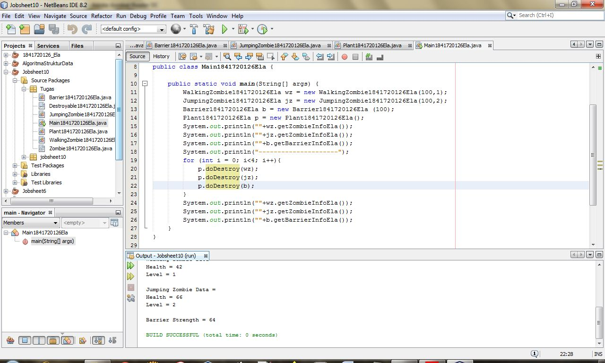
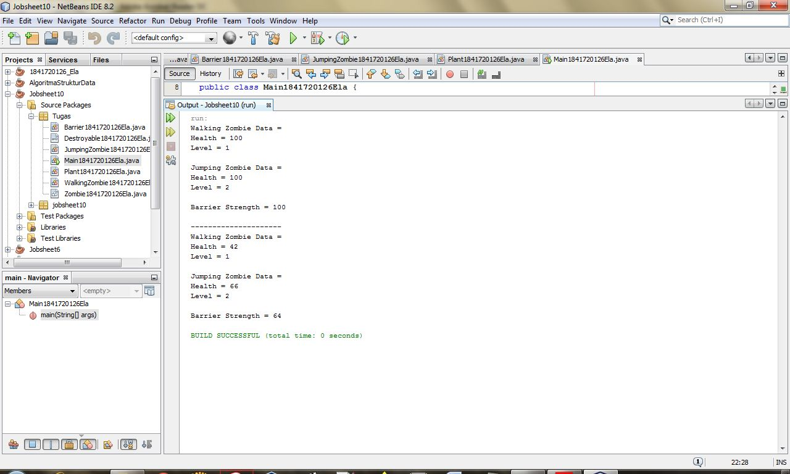

link kode program : 
[Barrier1841720126Ela](../../src/10_Polimorfisme/Barrier1841720126Ela.java)

link kode program : 
[Destroyable1841720126Ela](../../src/10_Polimorfisme/Destroyable1841720126Ela.java)

link kode program : 
[JumpingZombie1841720126Ela](../../src/10_Polimorfisme/JumpingZombie1841720126Ela.java)

link kode program : 
[Plant1841720126Ela](../../src/10_Polimorfisme/Plant1841720126Ela.java)

link kode program : 
[WalkingZombie1841720126Ela](../../src/10_Polimorfisme/WalkingZombie1841720126Ela.java)

link kode program : 
[Zombie1841720126Ela](../../src/10_Polimorfisme/Zombie1841720126Ela.java)

link kode program : 
[Main1841720126Ela](../../src/10_Polimorfisme/Main1841720126Ela.java)

## Kesimpulan

Pada dalam pratikum ini kita dapat Memahami konsep dan bentuk dasar polimorfisme, Memahami konsep virtual method invication, Menerapkan polimorfisme pada pembuatan heterogeneous collection, Menerapkan polimorfisme pada parameter/argument method, Menerapkan object casting untuk meng-ubah bentuk objek

## Pernyataan Diri

Saya menyatakan isi tugas, kode program, dan laporan praktikum ini dibuat oleh saya sendiri. Saya tidak melakukan plagiasi, kecurangan, menyalin/menggandakan milik orang lain.

Jika saya melakukan plagiasi, kecurangan, atau melanggar hak kekayaan intelektual, saya siap untuk mendapat sanksi atau hukuman sesuai peraturan perundang-undangan yang berlaku.

Ttd,

***(Ela Widya Lestari)***
