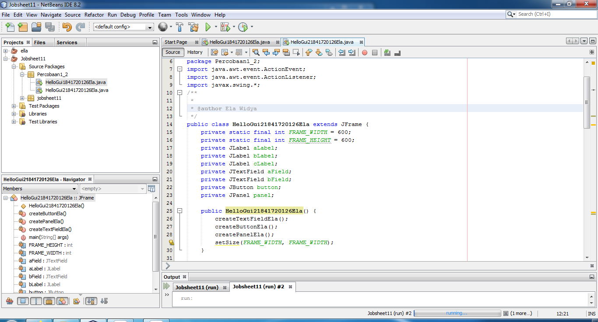
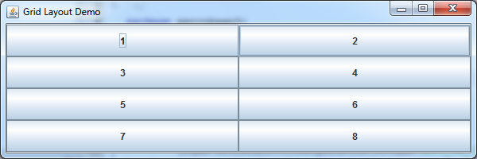
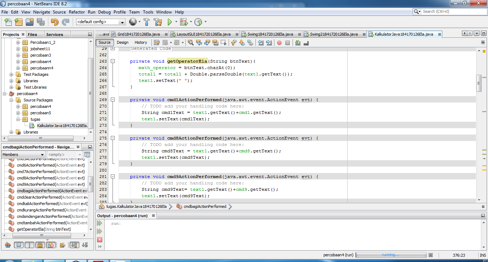

# Laporan Praktikum # 11 - GUI

## Kompetensi

1. Membuat aplikasi Graphical User Interface sederhana dengan bahasa pemrograman java.
2. Mengenal komponen GUI seperti frame, label, textfield, combobox, radiobutton, checkbox, textarea, menu, serta table.
3. Menambahkan event handling pada aplikasi GUI.

## Ringkasan Materi

 interaksi antara user dengan program tidak membosankan diperlukanlah sebuah interface yang menghubungkan antara user dengan  program dengan tampilan grafis, interface ini dinamakan dengan GUI(Graphical User Interface). Dalam pemrograman GUI terdapat beberapa bagian yang harus dilakukan yaitu: 
 1. Membuat windows utama  
 2. Menentukan komponen-komponen pendukung program  
 3. Menentukan tata letak layout agar nantinya semua komponen – komponen yang sudah dipersiapkan bisa diaatur sedemikian rupa  
 4. Event Handling dari sebuah aktivitas, seperti penekanan button, check box dan lain-lain 
 
 Java Swing merupakan bagian dari JFC (Java Foundation Classes) yang menyediakan API untuk menangani hal yang berkaitan dengan GUI bagi program Java.  Kita bisa membedakan komponen Swing dengan komponen AWT, di mana pada umumnya kelas-kelas yang berada dalam komponen Swing diawali dengan huruf J, misal: JButton, JLabel, JTextField, JRadioButton. 
 
# Percobaan

## Percobaan 1 – JFrame HelloGUI

link kode program : 
[HelloGui1841720126Ela](../../src/11_GUI/HelloGui1841720126Ela.java)

## Percobaan 2: Menangani Input Pada GUI 

link kode program : 
[HelloGui21841720126Ela](../../src/11_GUI/HelloGui21841720126Ela.java)

### Pertanyaan Percobaan 2

1. Modifikasi kode program dengan menambahkan JButton baru untuk melakukan fungsi perhitungan penambahan, sehingga ketika button di klik (event click) maka akan menampilkan hasil penambahan dari nilai A dan B

> jawab : 

## Percobaan 3: Manajemen Layou

link kode program : 
[Border1841720126Ela](../../src/11_GUI/Border1841720126Ela.java)

link kode program : 
[Box1841720126Ela](../../src/11_GUI/Box1841720126Ela.java)

link kode program : 
[Grid1841720126Ela](../../src/11_GUI/Grid1841720126Ela.java)

link kode program : 
[LayoutGUI1841720126Ela](../../src/11_GUI/LayoutGUI1841720126Ela.java)

### Pertanyaan 3: Manajemen Layou 

1. Apa perbedaan dari Grid Layout, Box Layout dan Border Layout?
> jawab :

•	Grid Layout : Menampilkan angkanya menggunakan tata letak kanan dan kiri.

•	Box Layout : Menampilkan angkanya terdapat pada box nya masing-masing dan menampilkan angkanya horizontal.

•	Border Layout : Menampilkan angkanya sesuai dengan table border yang telah dibuat dan telah diatur.

2. Apakah fungsi dari masing-masing kode berikut? 
> jawab : 
Untuk menampilkan setiap output dari perintah source code Border, Grid dan Box.

## Percobaan 4: Membuat GUI Melalui IDE Netbean

link kode program : 
[Swing1841720126Ela](../../src/11_GUI/Swing1841720126Ela.java)

### Pertanyaan Percobaan 4 

1. Apakah fungsi dari kode berikut?
> jawab :
Untuk menampilkan dari JFrame From. 
2. Mengapa pada bagian logika checkbox dan radio button digunakan multiple if ? 
> jawab :
Karena untuk melakukan pengecekkan centang pada checkbox dan radio button. 

3. Lakukan modifikasi pada program untuk melakukan menambahkan inputan berupa alamat dan berikan fungsi pemeriksaan pada nilai Alamat tersebut jika belum diisi dengan menampilkan pesan peringatan 
> jawab : 

## Percobaan 5: JTabPane, JTtree, JTable

link kode program : 
[Swing21841720126Ela](../../src/11_GUI/Swing21841720126Ela.java)

### Pertanyaan Percobaan 5

1. Apa kegunaan komponen swing JTabPane, JTtree, pada percobaan 5?
> jawab :

•	JTabPane : digunakan untuk tampilan atau backgroundnya untuk mengisi pada setiap halaman.

•	JTree : digunakan untuk menyimpan pada tambah jika button tambahnya digunakan.

2. Modifikasi program untuk menambahkan komponen JTable pada tab Halaman 1 dan tab Halaman 2 
> jawab : 

## Tugas

Buatlah Sebuah Program yang mempunyai fungsi seperti kalkulator (mampu menjumlahkan, mengurangkan, mengalikan dan membagikan. Dengan tampilan seperti berikut.

> jawab : 

link kode program : 
[KalkulatorJava184170126Ela](../../src/11_GUI/KalkulatorJava184170126Ela.java)

## Kesimpulan

Pada dalam pratikum ini kita dapat Membuat aplikasi Graphical User Interface sederhana dengan bahasa pemrograman java.Mengenal komponen GUI seperti frame, label, textfield, combobox, radiobutton, checkbox, textarea, menu, serta table.Menambahkan event handling pada aplikasi GUI.

## Pernyataan Diri

Saya menyatakan isi tugas, kode program, dan laporan praktikum ini dibuat oleh saya sendiri. Saya tidak melakukan plagiasi, kecurangan, menyalin/menggandakan milik orang lain.

Jika saya melakukan plagiasi, kecurangan, atau melanggar hak kekayaan intelektual, saya siap untuk mendapat sanksi atau hukuman sesuai peraturan perundang-undangan yang berlaku.

Ttd,

***(Ela Widya Lestari)***
