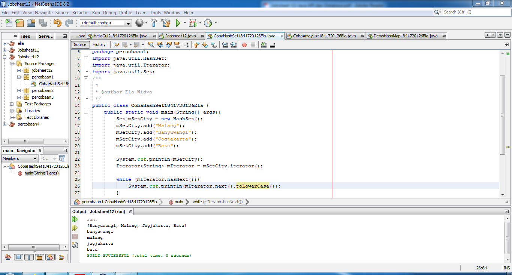
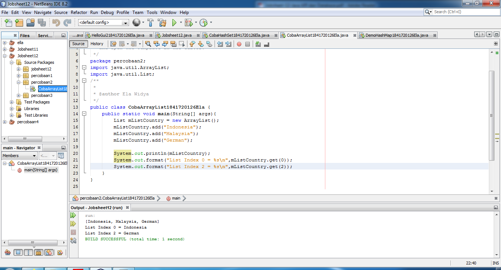
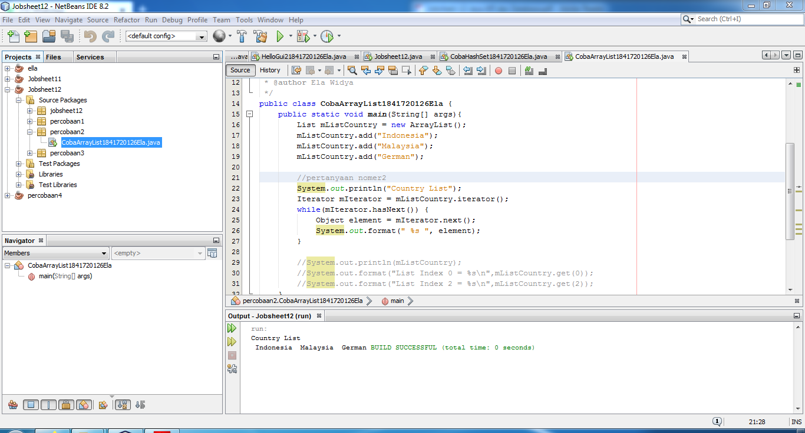
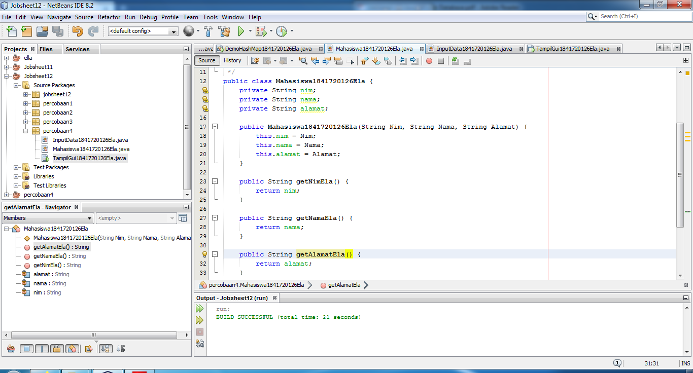
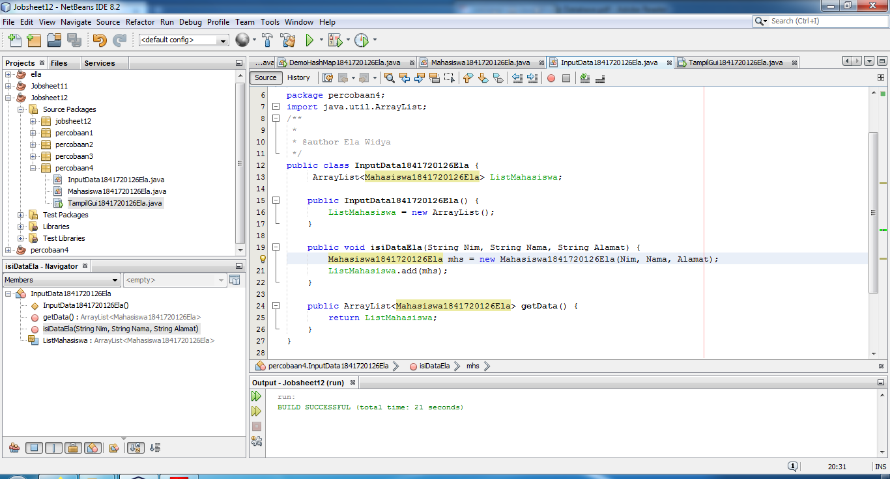
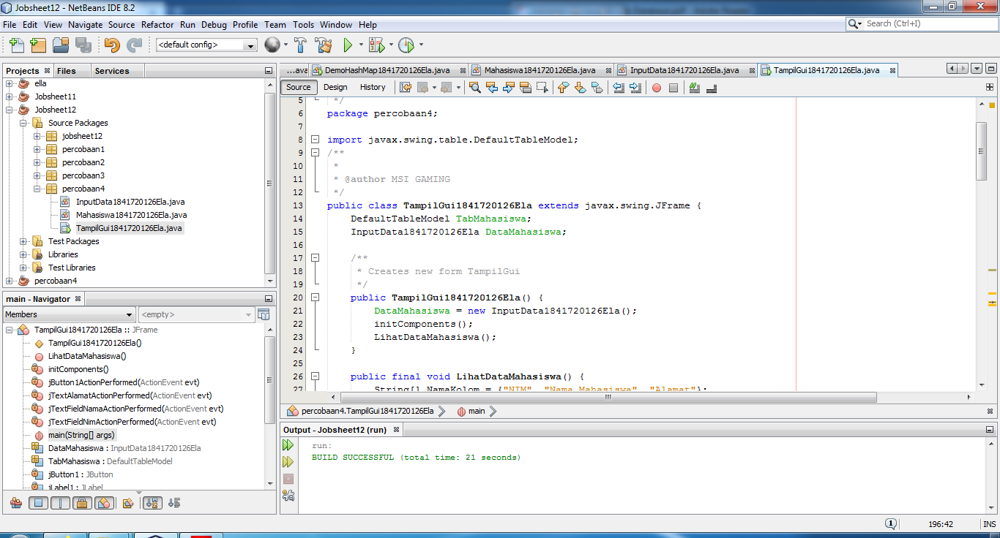
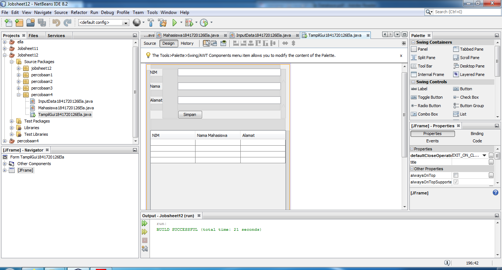
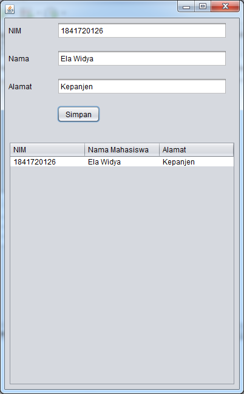

# Laporan Praktikum # 12 - Collection (List, Set, Map) dan Database  

## Kompetensi

1. Memahami cara penyimpanan objek menggunakan Collection dan Map. 
2. Mengetahui pengelompokan dari Collection. 
3. Mengetahui perbedaan dari interface Set, List dan Map. 
4. Mengetahui penggunaan class-class dari interface Set, List, dan Map. 
5. Memahami koneksi database menggunakan JDBC dan JDBC API

## Ringkasan Materi

Collection adalah suatu objek yang bisa digunakan untuk menyimpan sekumpulan objek. Objek yang ada dalam Collection disebut elemen. Collection menyimpan elemen yang bertipe Object, sehingga berbagai tipe object bisa disimpan dalam Collection. Class-class mengenai Collection tergabung dalam Java Collection Framework. Class-class Collection diletakkan dalam package java.util dan mempunyai dua interface utama yaitu Collection. 

 Collection terbagi menjadi 3 kelompok yaitu : 
 1. set
 2. list
 3. map
 
# Percobaan

## Percobaan 1 (Set)

link kode program : 
[CobaHashSet1841720126Ela](../../src/12_Java_API/CobaHashSet1841720126Ela.java)

### Pertanyaan Percobaan 1 

1. Apakah fungsi import java.util.*; pada program diatas!
> Jawab :
Untuk mengimpor semua kelas di dalam java.

2. Pada baris program keberapakah yang berfungsi untuk menciptakan object HashSet?
> Jawab :
Pada baris ke-16.

3. Apakah fungsi potongan program dibawah ini pada percobaan 1!
> Jawab :
Untuk menambahkan objek kedalam HashSet()

4. Tambahkan set.add(“Malang”); kemudian jalankan program! Amati hasilnya dan
jelaskan mengapa terjadi error!
> Jawab :
Karena nama objek yang seharusnya adalah mSetCity. Jika mengunakan set maka
program tidak mengenali objek tersebut.

5. Jelaskan fungsi potongan program dibawah ini pada percobaan 1!
> Jawab :
Iterator digunakan untuk mengakses dan menampilkan nilai beserta tambahan ethod lalin
yang didefinisikan di dalam interface Iterator.

## Percobaan 2 (List) 

link kode program : 
[CobaArrayList1841720126Ela](../../src/12_Java_API/CobaArrayList1841720126Ela.java)

### Pertanyaan Percobaan 2

1. Apakah fungsi potongan program dibawah ini!
> Jawab :
Untuk menampilkan nilai dari mListCountry dan menampilkan data mListCountry index
ke 0 dan index ke 2.

2. Ganti potongan program pada soal no 1 menjadi sebagai berikut!
Kemudian jalankan program tersebut!
> Jawab :

3. Jelaskan perbedaan menampilkan data pada ArrayList menggunakan potongan program
pada soal no 1 dan no 2!
> Jawab :
Ketika menggunakan potongan program no 1 maka menampilkan data menggunakan list,
sedangkan pada potongan program no 2 menampilkan semua data dengan iterator.

## Percobaan 3 (Map)

link kode program : 
[DemoHashMap1841720126Ela](../../src/12_Java_API/DemoHashMap1841720126Ela.java)

### Pertanyaan percobaan 3

1. Jelaskan fungsi hMapItem.put("1","Biskuit") pada program!
> Jawab :
Untuk menambahkan object dengan key 1 dengan nama biscuit ke dalam object
hMapItem pada HashMap().
2. Jelaskan fungsi hMapItem.size() pada program!
> Jawab :
Untuk menampilkan size atau banyak data dari hMapItem.
3. Jelaskan fungsi hMapItem.remove("1") pada program!
> Jawab :
Untuk menghapus item dengan key 1.
4. Jelaskan fungsi hMapItem.clear() pada program!
> Jawab :
Untuk menghapus semua data yang ada pada hMapItem.
5. Tambahkan kode program yang di blok pada program yang sudah anda buat!
> Jawab :

6. Jalankan program dan amati apa yang terjadi!
> Jawab :

## Percobaan 4 (Implementasi ArrayList dalam GUI)

link kode program : 
[Mahasiswa1841720126Ela](../../src/12_Java_API/Mahasiswa1841720126Ela.java)

link kode program : 
[InputData1841720126Ela](../../src/12_Java_API/InputData1841720126Ela.java)

link kode program : 
[TampilGui1841720126Ela](../../src/12_Java_API/TampilGui1841720126Ela.java)

## Kesimpulan

Pada dalam pratikum ini kita dapat  Memahami cara penyimpanan objek menggunakan Collection dan Map. Mengetahui pengelompokan dari Collection. Mengetahui perbedaan dari interface Set, List dan Map. Mengetahui penggunaan class-class dari interface Set, List, dan Map. dan Memahami koneksi database menggunakan JDBC dan JDBC API.

## Pernyataan Diri

Saya menyatakan isi tugas, kode program, dan laporan praktikum ini dibuat oleh saya sendiri. Saya tidak melakukan plagiasi, kecurangan, menyalin/menggandakan milik orang lain.

Jika saya melakukan plagiasi, kecurangan, atau melanggar hak kekayaan intelektual, saya siap untuk mendapat sanksi atau hukuman sesuai peraturan perundang-undangan yang berlaku.

Ttd,

***(Ela Widya Lestari)***
