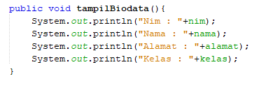
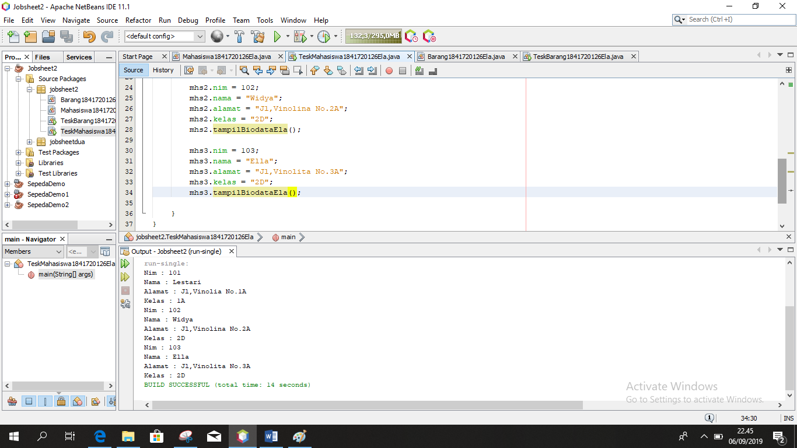
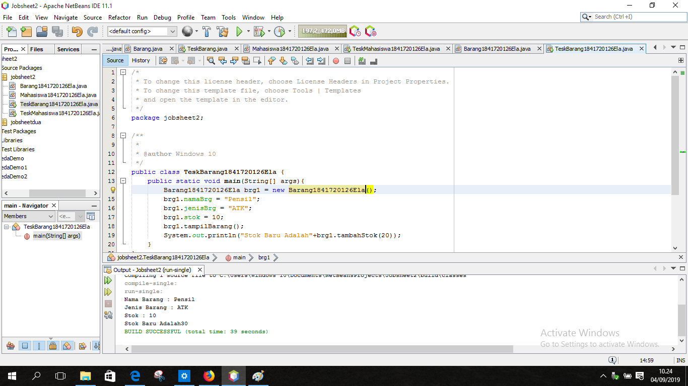

# Laporan Praktikum #1 - Pengantar Konsep PBO

## Kompetensi

1. Memahami deskripsi dari class dan objek 
2. Memehami implementasi dari method 

## Ringkasan Materi

> Pemrograman berorientasi obyek (PBO) merupakan paradigma pemrograman yang popular saat ini yang telah menggantikan teknik pemrograman berbasis prosedur. class merupakan cetakan untuk menciptakan suatu instant dari objek` 
## Percobaan

### Percobaan 1

Cara awal membuat class, membuat object, kemudian cara mengakses method di dalam class tersebut.

Studi Kasus 1: Dalam suatu perusahaan salah satu data yang diolah adalah data karyawan. Setiap karyawan memiliki id, nama, jenis kelamin, jabatan, jabatan, dan gaji. Setiap mahasiswa juga bisa menampilkan data diri pribadi dan melihat gajinya. 
 
1.	Gambarkan desain class diagram dari studi kasus 1!, 
> 

2.	Sebutkan Class apa saja yang bisa dibuat dari studi kasus 1!, 
Class : 
•	Class Karyawan1841720126Ela
•	Class TestKaryawan1841720126Ela

3.	Sebutkan atribut beserta tipe datanya yang dapat diidentifikasi dari masing-masing class dari studi kasus 1! 
Atribut dan tipe data : 
•	idKaryawan : int
•	namaKaryawan : String
•	jenisKelamin : String
•	jabatan : String
•	gaji : int

4.	Sebutkan method-method yang sudah anda buat dari masing-masing class pada studi kasus 1!
Method : 
•	tampilDataEla();

### Percobaan 2

Study Kasus 2 : 

link kode program : [Mahasiswa1841720126Ela](../../src/2_Class_dan_Object/Mahasiswa1841720126Ela.java)
link kode program : [TeskMahasiswa1841720126Ela](../../src/2_Class_dan_Object/TeskMahasiswa1841720126Ela.java)

1. jelaskan pada bagian mana proses pendeklarasian atribut pada program diatas?
jawab : 

2. jelaskan pada bagian mana proses pendeklarasian method pada program diatas ?
jawab : 

3. berapa banyak objek yang di instansial pada program di atas!
jawab : 

4.	Apakah yang sebenarnya dilakukan pada sintaks program “mhs1.nim=101” ?
Jawab : 
Untuk mengisikan nilai untuk data nim
5.	Apakah yang sebenarnya dilakukan pada sintaks program “mhs1.tampilBiodata()” ?
Jawab : 
Untuk memanggil method tampilBiodata(); untuk menampilkan hasil biodata mahasiswa
6.	Instansiasi 2 objek lagi pada program diatas!
Jawab : 

## Percobaan 3 

link kode program : [Barang1841720126Ela](../../src/2_Class_dan_Object/Mahasiswa1841720126Ela.java)

link kode program : [TeskBarang1841720126Ela](../../src/2_Class_dan_Object/TeskMahasiswa1841720126Ela.java)

1.	Apakah fungsi argumen dalam suatu method?
Jawab : 
Memberikan nilai yang harus dieksekusi dalam method tersebut.
2.	Ambil kesimpulan tentang kegunaan dari kata kunci return , dan kapan suatu method harus memiliki return!
Jawab : 
Return digunakan untuk tipe data int karena untuk mengembalikan nilai int.

## Tugas

 1. Suatu toko persewaan video game salah satu yang diolah adalah peminjaman, dimana data yang dicatat ketika ada orang yang melakukan peminjaman adalah id, nama member, nama game, dan harga yang harus dibayar. Setiap peminjaman bisa menampilkan data hasil peminjaman dan harga yang harus dibayar. Buatlah class diagram pada studi kasus diatas! 
 
Penjelasan: 
 Harga yang harus dibayar diperoleh dari lama sewa x harga. 
 Diasumsikan 1x transaksi peminjaman game yang dipinjam hanya 1 game saja. 
jawab : 

2. buatlah program dari class diagram yang sudah anda buuat di no.1
jawab : 

link kode program : [SewaGame1841720126Ela](../../src/2_Class_dan_Object/SewaGame1841720126Ela.java)

link kode program : [TestSewaGame1841720126Ela](../../src/2_Class_dan_Object/TestSewaGame1841720126Ela.java)

3. buatlah program sesuai dengan class diagram berikut ini.

link kode program :
[Lingkaran1841720126Ela](../../src/2_Class_dan_Object/Lingkaran1841720126Ela.java)

link kode program : [TestLingkaran1841720126Ela](../../src/2_Class_dan_Object/TestLingkaran1841720126Ela.java)

4. buatlah program sesuai dengan class diaagram berikut ini.

link kode program : [BarangTugas1841720126Ela](../../src/2_Class_dan_Object/BarangTugas1841720126Ela.java)

link kode program : [TestBarangTugas1841720126Ela](../../src/2_Class_dan_Object/TestBarangTugas1841720126Ela.java)

## Kesimpulan

dalam pratikum ini kita dapat memahami deskripsi dari class dan ojek. dan memahani implementasi dari method.

## Pernyataan Diri

Saya menyatakan isi tugas, kode program, dan laporan praktikum ini dibuat oleh saya sendiri. Saya tidak melakukan plagiasi, kecurangan, menyalin/menggandakan milik orang lain.

Jika saya melakukan plagiasi, kecurangan, atau melanggar hak kekayaan intelektual, saya siap untuk mendapat sanksi atau hukuman sesuai peraturan perundang-undangan yang berlaku.

Ttd,

***(Ela Widya Lestari)***
