# Laporan Praktikum 4 - Relasi Class

## Kompetensi

1. Memahami konsep enkpsulasi dan konstruktor 
2. Memahami konsep akses modifier
3. Memahami konsep Instansiasi atribut atau method

## Ringkasan Materi

> Enkapsukasi disebut juga dengan information-hiding. Dalam berinteraksi dengan objek, seringkali kita tidak perlu mengetahui kompleksitas yang ada didalamnya. 
enkapsulasi atau disebut juga information-hiding atau data hiding adalah menyembunyikan detail proses suatu objek dari pengguna. 
 
## Percobaan

### Percobaan 1-Enkapsulasi

Didalam percobaan enkapsulasi, buatlah class Motor yang memiliki atribut kecepatan dan kontakOn, dan memiliki method printStatus() untuk menampilkan status motor. Seperti berikut 
1. Buka Netbeans, buat project MotorEncapsulation. 
2. Buat class Motor. Klik kanan pada package motorencapsulation – New – Java Class. 
3. Ketikkan kode class Motor dibawah ini. 

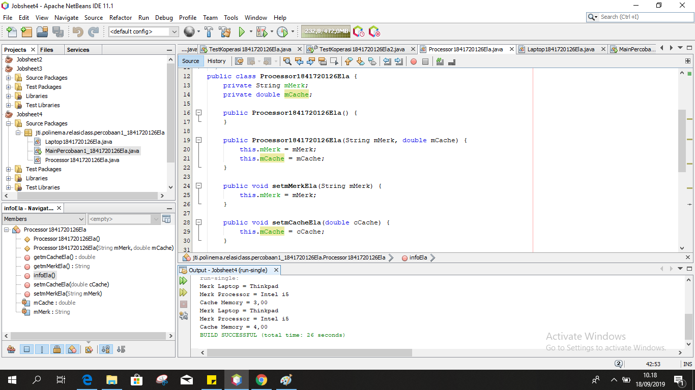

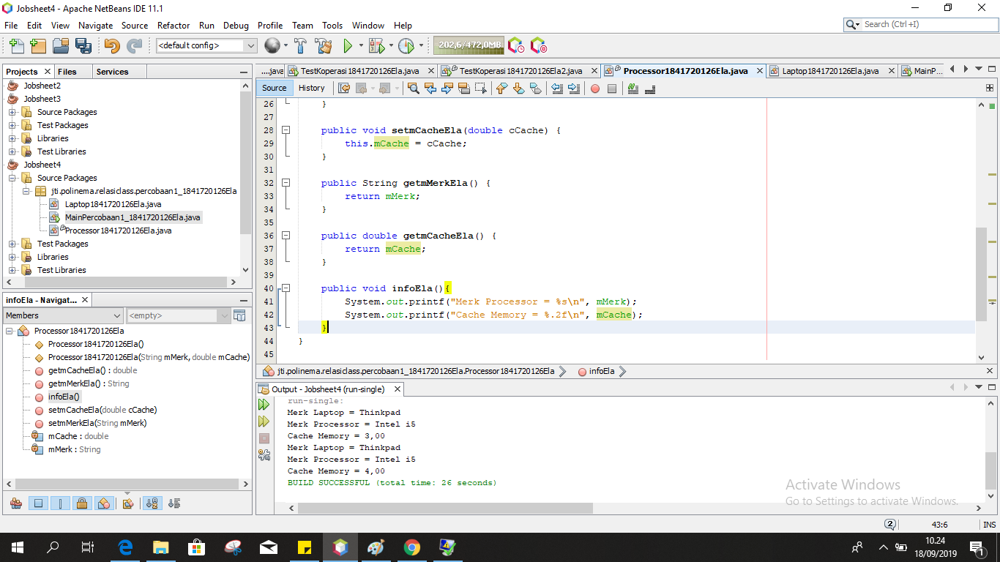

link kode program : 
[Motor1841720126Ela](../../src/3_Enkapsulasi/Motor1841720126Ela.java)
link kode program : 
[MotorDemo1841720126Ela](../../src/3_Enkapsulasi/MotorDemo1841720126Ela.java)

### Percobaan 2 - Access Modifier

Pada percobaan ini akan digunakan access modifier untuk memperbaiki cara kerja class Motor pada percobaan ke-1. 

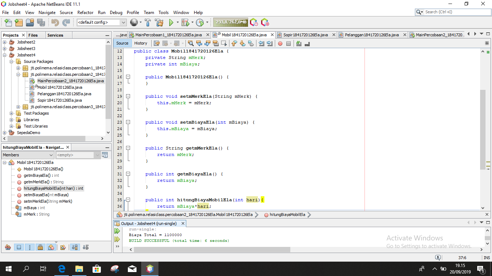

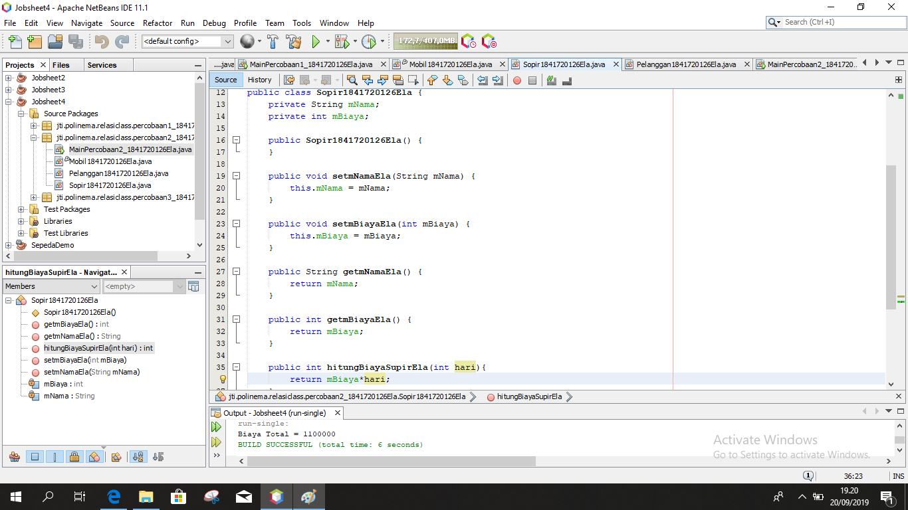

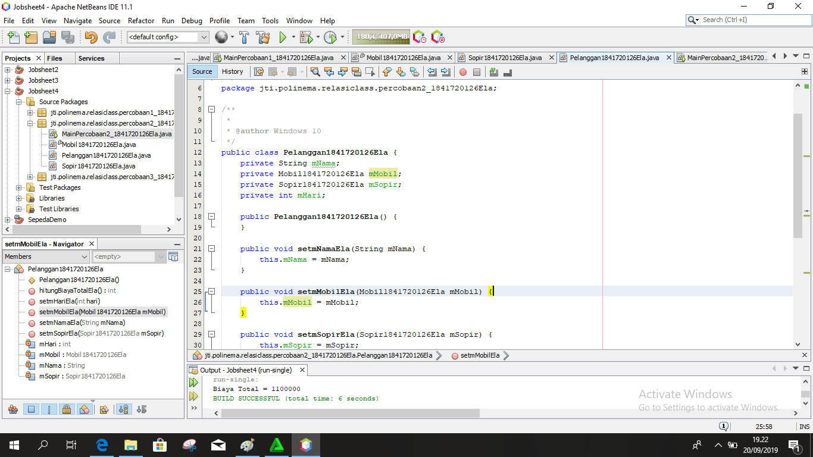

link kode program : [Motor1841720126Ela](../../src/3_Enkapsulasi/Motor1841720126Ela.java)
link kode program : [MotorDemo1841720126Ela](../../src/3_Enkapsulasi/MotorDemo1841720126Ela.java)

## Pertanyaan percobaan 2

1. Pada class TestMobil, saat kita menambah kecepatan untuk pertama kalinya,
 mengapa muncul peringatan “Kecepatan tidak bisa bertambah karena Mesin Off!”?  
jawab : : Karena status kontak masih off,  oleh karena itu kecepatan tidak bisa ditambah kecuali dinyalakan terlebih dahulu 
2. Mengapat atribut kecepatan dan kontakOn diset private?
jawab :  Agar atribut kecepatan pada class Motor.java tidak bisa diganti nilainya kecuali dengan method khusus pada class MotorDemo1841720126Ela.java 
3. Ubah class Motor sehingga kecepatan maksimalnya adalah 100! 
jawab : 

 

## Percobaan 3-Getter dan Setter
Misalkan di sebuah sistem informasi koperasi, terdapat class Anggota. Anggota memiliki atribut nama, alamat dan simpanan, dan method setter, getter dan setor dan pinjam.
Semua atribut pada anggota tidak boleh diubah sembarangan, melainkan hanya dapat diubah melalui method setter, getter, setor dan tarik.
Khusus untuk atribut simpanan tidak terdapat setter karena simpanan akan bertambah ketika melakukan transaksi setor dan akan berkurang ketika melakukan peminjaman/tarik. 

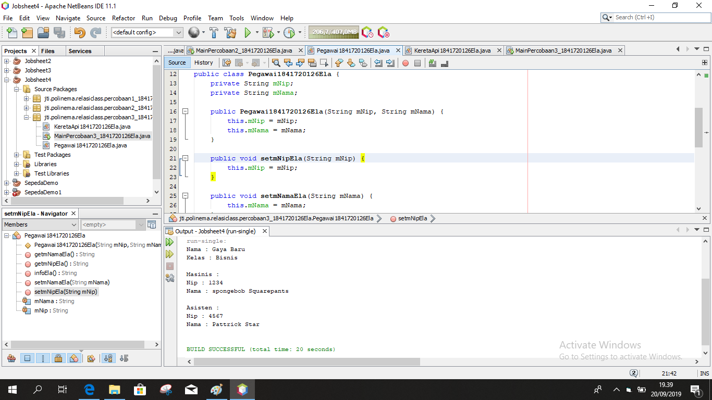

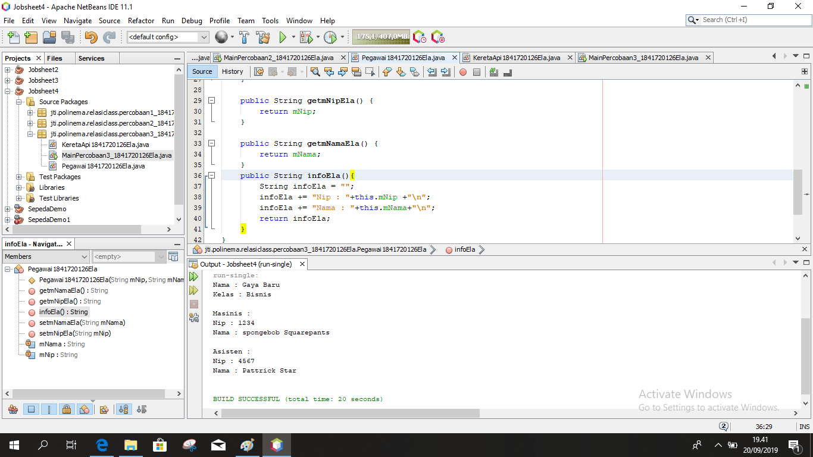

link kode program : [Anggota1841720126Ela](../../src/3_Enkapsulasi/Anggota1841720126Ela.java)
link kode program : [KoperasiDemo1841720126Ela](../../src/3_Enkapsulasi/KoperasiDemo1841720126Ela.java)

Dapat dilihat pada hasil percobaan diatas, untuk mengubah simpanan tidak dilakukan secara
 langsung dengan mengubah atribut simpanan, melainkan melalui method setor() dan pinjam(). 
Untuk menampilkan nama pun harus melalui method getNama(), dan untuk menampilkan simpanan melalui getSimpanan(). 

## Percobaan 4-Konstruktor Instansiasi

1. Langkah pertama percobaan 4 adalah ubah class KoperasiDemo1841720126Ela seperti berikut dan Hasil dari program tersebut adalah sebagai berikut
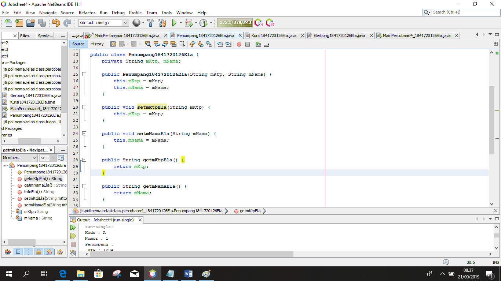

2. Ubah class Anggota1841720126Ela menjadi seperti berikut 
 Pada class Anggota1841720126Ela dibuat kontruktor dengan access modifier default yang memiliki 2 parameter nama dan alamat. Dan didalam konstruktor tersebut dipastikan nilai simpanan untuk pertama kali adalah Rp. 0.
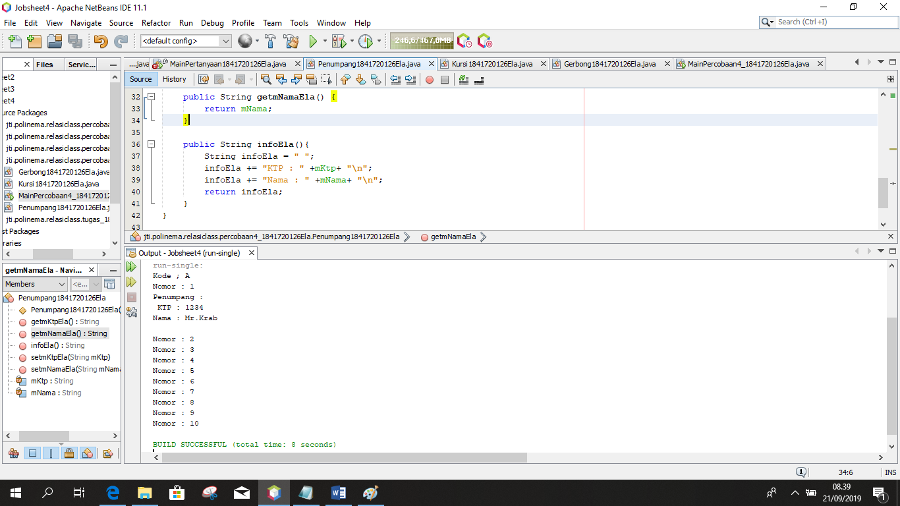

3. Selanjutnya ubah class KoperasiDemo1841720126Ela sebagai berikut
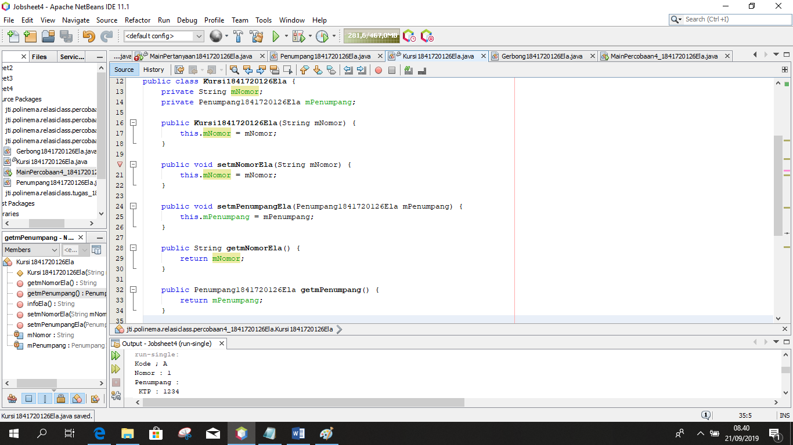

link kode program : [Anggota1841720126Ela](../../src/3_Enkapsulasi/Anggota1841720126Ela.java)
link kode program : [KoperasiDemo1841720126Ela](../../src/3_Enkapsulasi/KoperasiDemo1841720126Ela.java)

Setelah menambah konstruktor pada class Anggoata maka atribut nama dan alamat secara otomatis harus diset terlebih dahulu 
dengan melakukan passing parameter jika melakukan instansiasi class Anggota. Hal ini biasa dilakukan untuk atribut yang 
membutuhkan nilai yang spesifik. Jika tidak membutuhkan nilai spesifik dalam konstruktor tidak perlu parameter. 
Contohnya simpanan untuk anggota baru diset 0, maka simpanan tidak perlu untuk dijadikan parameter pada konstruktor. 

## Pertanyaan Percobaan 3 & 4

1. Apa yang dimaksud getter dan setter? 
Jawab : Getter adalah public method dan memiliki tipe data return, yang berfungsi untuk mendapatkan nilai dari atribut private. Sedangkan setter adalah public method yang tidak memliki tipe data return, yang berfungsi untuk memanipulasi nilai dari atribut private. 
2. Apa kegunaan dari method getSimpanan()? 
Jawab : Merupakan method yang digunakan untuk mendapatkan nilai dari atribut simpanan yang nantinya method tersebut digunkan untuk menampilkan nilai dari atribut simpanan 
3. Method apa yang digunakan untk menambah saldo? 
Jawab : Method setor 
4. Apa yand dimaksud konstruktor? 
Jawab : Konstruktor mirip dengan method cara deklarasinya akan tetapi tidak memiliki tipe return. Dan konsturktor dieksekusi ketika instan dari objek dibuat. Jadi setiap kali sebuat objek dibuat dengan keyword new() maka konstruktor akan dieksekusi. Atau kalau dari pandangan saya konstruktor merupakan cara untuk menambah parameter pada objek. 
5. Sebutkan aturan dalam membuat konstruktor? 
Jawab :  
• Nama konstruktor harus sama dengan nama class 
• Konstruktor tidak memiliki tipe data return 
• Konstruktor tidak boleh menggunakan modifier abstract, static, final, dan syncronized 
6. Apakah boleh konstruktor bertipe private? 
Jawab : Tidak, bila private maka objek tidak bisa diakes atau tidak bisa di instansiasi oleh class lain 
7. Kapan menggunakan parameter dengan passsing parameter? 
Jawab : Bila kita menggunakan konstruktor maka sebaiknya kita menggunakan passing parameter dan juga sebaliknya. 
8. Apa perbedaan atribut class dan instansiasi atribut? 
Jawab :  Class merupakan brueprint dari prototype dari objek, kalau instansiasi dibunakan untuk memanggil sebuah objek dari class yang lain. 
9. Apa perbedaan class method dan instansiasi method? 
Jawab : Method merupakan suatu operasi berupa fungsi-fungsi yang dapat dikerjakan oleh suatu object.

## Tugas

 1. Cobalah program dibawah ini dan tuliskan hasil outputnya 
jawab : 
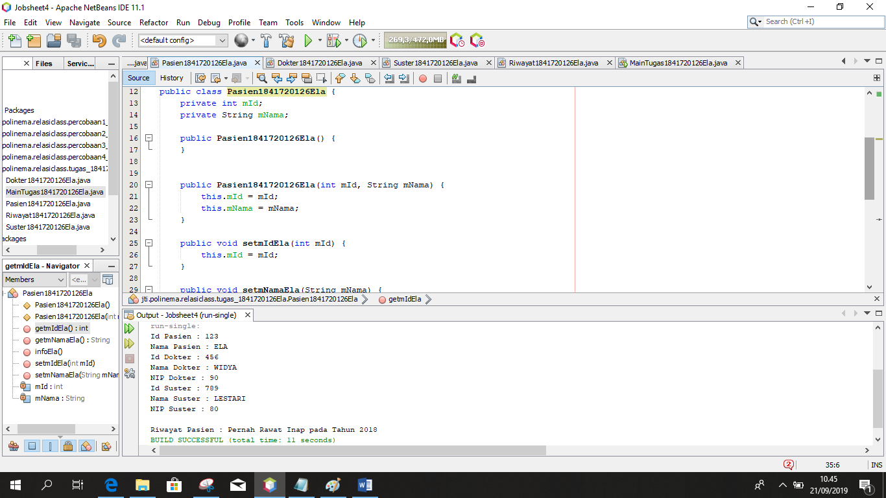

link kode program : [EncapDemo1841720126Ela](../../src/3_Enkapsulasi/EncapDemo1841720126Ela.java)
link kode program : [EncapTest1841720126Ela](../../src/3_Enkapsulasi/EncapTest1841720126Ela.java)

2. Pada program diatas, pada class EncapTest kita mengeset age dengan nilai 35, namun pada saat ditampilkan ke layar nilainya 30, jelaskan mengapa. 
jawab : 
 Karena pada method setAgeEla() terdapat percabangan yang didalamnya berisi bila nilai dari atribut age lebih dari 30 maka nilai age akan menjadi 30 

3. Ubah program diatas agar atribut age dapat diberi nilai maksimal 30 dan minimal 18. 
jawab : 

link kode program : [EncapDemo1841720126Ela](../../src/3_Enkapsulasi/EncapDemo1841720126Ela.java)
link kode program : [EncapTest1841720126Ela](../../src/3_Enkapsulasi/EncapTest1841720126Ela.java)

4. Pada sebuah sistem informasi koperasi simpan pinjam, terdapat class Anggota yang memiliki atribut antara lain nomor KTP, nama, limit peminjaman, dan jumlah pinjaman.
Anggota dapat meminjam uang dengan batas limit peminjaman yang ditentukan.
Anggota juga dapat mengangsur pinjaman. Ketika Anggota tersebut mengangsur pinjaman, 
maka jumlah pinjaman akan berkurang sesuai dengan nominal yang diangsur.
Buatlah class Anggota tersebut, berikan atribut, method dan konstruktor sesuai dengan kebutuhan.
Uji dengan TestKoperasi berikut ini untuk memeriksa apakah class Anggota yang anda buat telah sesuai dengan yang diharapkan. 
jawab : 

link kode program : [AnggotaTugas1841720126Ela](../../src/3_Enkapsulasi/AnggotaTugas1841720126Ela.java)
link kode program : [TestKoperasi1841720126Ela](../../src/3_Enkapsulasi/TestKoperasi1841720126Ela.java)

5. Modifikasi soal no. 4 agar nominal yang dapat diangsur minimal adalah 10% dari jumlah pinjaman saat ini.
Jika mengangsur kurang dari itu, maka muncul peringatan “Maaf, angsuran harus 10% dari jumlah pinjaman”. 
jawab : 

link kode program : [AnggotaTugas1841720126Ela](../../src/3_Enkapsulasi/AnggotaTugas1841720126Ela.java)
link kode program : [TestKoperasi1841720126Ela](../../src/3_Enkapsulasi/TestKoperasi1841720126Ela.java)

6. Modifikasi class TestKoperasi, agar jumlah pinjaman dan angsuran dapat menerima input dari console. 
jawab : 

link kode program : [AnggotaTugas1841720126Ela](../../src/3_Enkapsulasi/AnggotaTugas1841720126Ela.java)
link kode program : [TestKoperasi1841720126Ela2](../../src/3_Enkapsulasi/TestKoperasi1841720126Ela2.java)

## Kesimpulan

dalam pratikum ini, telah dipelajari konsep  enkpsulasi dan konstruktor. Memahami konsep akses modifier.
Memahami konsep Instansiasi atribut atau method  Cara penggunaan getter dan setter beserta fungsi dari getter dan setter.  

## Pernyataan Diri

Saya menyatakan isi tugas, kode program, dan laporan praktikum ini dibuat oleh saya sendiri. Saya tidak melakukan plagiasi, kecurangan, menyalin/menggandakan milik orang lain.

Jika saya melakukan plagiasi, kecurangan, atau melanggar hak kekayaan intelektual, saya siap untuk mendapat sanksi atau hukuman sesuai peraturan perundang-undangan yang berlaku.

Ttd,

***(Ela Widya Lestari)***
