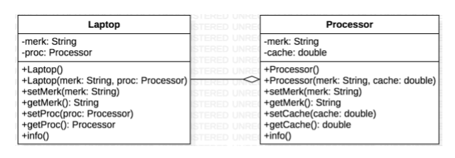
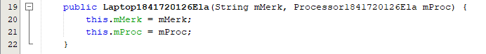
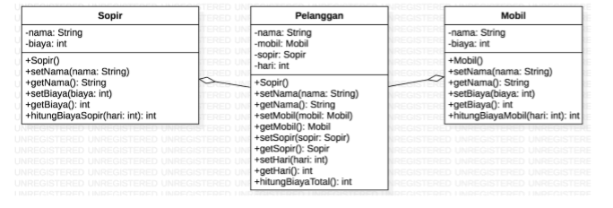
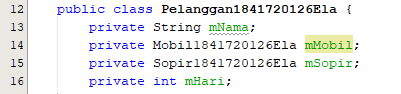
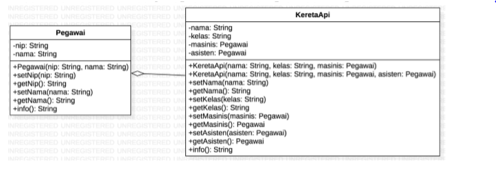
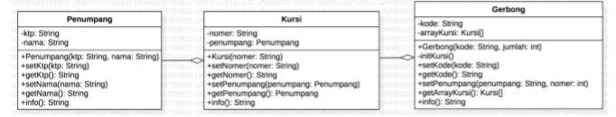

# Laporan Praktikum 4 - Relasi Class

## Kompetensi

1. Memahami konsep relasi class 
2. Memahami konsep mengimplementasikan relasi has-a dalam program

## Ringkasan Materi

> suatu sistem akan ditemukan lebih dari satu class yang saling memiliki keterkaitan antara class satu dengan yang lain. Pada percobaan‑percobaan sebelumnya, mayoritas kasus yang sudah dikerjakan hanya fokus pada satu class saja. Pada jobsheet ini akan dilakukan percobaan yang melibatkan beberapa class yang saling berelasi. 

 
## Percobaan

### Percobaan 1

Class Diagram 
 

link kode program : 
[Processor1841720126Ela](../../src/4_Relasi_Class/Processor1841720126Ela.java)
link kode program : 
[Laptop1841720126Ela](../../src/4_Relasi_Class/Laptop1841720126Ela.java)
link kode program : 
[MainPercobaan1_1841720126Ela](../../src/4_Relasi_Class/MainPercobaan1_1841720126Ela.java)

### Pertanyaan Percobaan 1

1. Di dalam class Processor dan class Laptop , 
terdapat method setter dan getter untuk masing‑masing atributnya. 
Apakah gunanya method setter dan getter tersebut ? 
jawab : 
fungsinya sesuai dengan namanya yaitu untu menge-set (memberi nilai) 
dan menge-get (mendapatkan/melihat nilai) pada suatu variabel atau class 
dengan contructor default

2. Di dalam calss processor dan class Laptop, masing-masing terdapat kontruktor default dan kontruktor berparameter. 
Bagaimana beda penggunaan dari kedua jenis konstruktor tersebut?
jawab : 
bila konstruktor default, untuk memberi nilai menggunakan setter, 
tetapi jika kita menggunakan konstruktor berparameter, 
kita hanya perlu memberi nilai di parameter pada objek di class main.

3. Perhatikan class Laptop, diantara 2 atribut yang dimiliki (merk dan proc), atribut mana yang bertipe object?
Jawab : 
proc, karena inisiasi tipe variabel ditandai dengan nama object.

4. Perhatikan class Laptop, pada baris manakah yang menunjukan bahwa class Laptop memiliki relasi dengan class Processor?
Jawab : 
Terlihat jelas pada constructor, terdapat parameter yang menggunakan object Processor yang telah diinisiasi sebelumnya.

5. Perhatikan class Laptop, apakah guna dari sintaks proc.Info()?
Jawab : proc.Info(), merupakan syntax yang digunakan untuk menjalankan method Info() pada class Processor.

6. Pada class MainPercobaan1, terdapat baris kode Laptop l = new Laptop(“Thinkpad”, p);  . apakah p tersebut? Dan apakah yang tejadi jika baris tersebut diubah menjadi Laptop l = new Laptop(“Thinkpad”, new Processor(“Intel i5”, 3)); . Bagaimana hasil program saat dijalankan, apakah ada perubahan?
Jawab : p merupakan object dari class Processor yang tadi telah diinstansiasi, Lalu kode program yang baru hasilnya sama saja, kode program tersebut memiliki perbedaan pada instansiasi dalam bentuk variabel object, bila pada kode program tersebut object tidak perlu diinstansiasi kedalam variabel lain tetapi ter nested atau bisa dibilang melakukan instansiasi objek dialam instansiasi object.

### Percobaan 2 

Perhatikan diagram class berikut yang menggambarkan sistem rental mobil. Pelanggan bisa menyewa mobil sekaligus sopir. Biaya sopir dan biaya sewa mobil dihitung per hari. 

link kode program : 
[Mobil1841720126Ela](../../src/4_Relasi_Class/Mobil1841720126Ela.java)
link kode program : 
[Sopir1841720126Ela](../../src/4_Relasi_Class/Sopir1841720126Ela.java)
link kode program : 
[Pelanggan1841720126Ela](../../src/4_Relasi_Class/Pelanggan1841720126Ela.java)
link kode program : 
[MainPercobaan2_1841720126Ela](../../src/4_Relasi_Class/MainPercobaan2_1841720126Ela.java)

### Pertanyaan percobaan 2

1. Perhatikan class Pelanggan. Pada baris program makanan yang menunjukan bahwa class Pelanggan memiliki relasi dengan class Mobil dan class Sopir?
Jawab :  
Dapat dilihat pada inisiasi  variabel object di class pelanggan

2. Perhatikan method hitungBiayaSopir pada class Sopir, serta method hitungBiayaMobil pada calss Mobil. Mengapa menurut anda method tersebut harus memiliki argument hari?
Jawab : 
argumen tersebut nantinya digunakan untuk diisi dengan variabel int hari pada class Pelanggan 

3. Perhatikan class Pelanggan. Untuk apakah perintah
mobil.hitungBiayaMobil(hari) dan sopir.hitungBiayaSopir(hari)?
Jawab : 
kode program tersebut digunakan untuk menjumlahkan biaya mobil yang diambil dari harga sopir dikali dengan hari lalu yang dijumlahkan dengan biaya sopir yang diambil dari harga sopir dikali hari.

4. Perhatikan class MainPercobaan2. Untuk apakah sintaks p.setMobil(m) dan p.setSopir(s)?
Jawab : 
kode program tersebut digunakan untuk memberi atau mengisi nilai dari namaMobil dan namaSopir yang ada pada objek pelanggan

5. Perhatikan class MainPercobaan2. Untuk apakah proses p.hitungBiayaTotal() tersebut?
jawab : 
Digunakan untuk menghitung biaya total dari penjumlahan antara biaya sopir dan biaya mobil.

6. Perhatikan class MainPercobaan2 coba tambahkan pada baris terakhir dari method main dan amati perubahan saat di-run!
System.out.println(p.getMobil().getMerk();
Jadi untuk apakah sintaks diatas yang ada didalam method main tersebut?
Jawab : 
perintah tersebut digunakan untuk menggembalikan atau me return nilai atribut dari method  getMerk() pada class Mobil melalui objek pelanggan, atau setelah me return object Mobil pada class pelanggan, object mobil akan me return String getMerk() pada class mobil

 

## Percobaan 3

Pada percobaan‑percobaan sebelumnya, relasi dalam class dinyatakan dalam one‑to‑one. Tetapi ada kalanya relasi class melibatkan lebih dari satu. Hal ini disebut dengan multiplicity. Untuk relasi lebih rinci mengenai multiplicity, dapat dilihat pada tabel berikut. 
Sebuah Kereta Api dioperasikan oleh Masinis serta seorang Asisten Masinis. Baik Masinis maupun Asisten Masinis keduanya merupakan Pegawai PT. Kereta Api Indonesia. Dari ilustrasi cerita tersebut, dapat digambarkan dalam diagram kelas sebagai berikut: 

link kode program : 
[Pegawai1841720126Ela](../../src/4_Relasi_Class/Pegawai1841720126Ela.java)
link kode program : 
[KeretaApi1841720126Ela](../../src/4_Relasi_Class/KeretaApi1841720126Ela.java)
link kode program : 
[MainPercobaan3_1841720126Ela](../../src/4_Relasi_Class/MainPercobaan3_1841720126Ela.java)

## Pertanyaan Percobaan 3 

1. Dalam method info() pada class KeretaApi, baris this.masinis.info() dan this.asisten.info() digunakan untuk apa?
Jawab : 
digunakan untuk memanggil method Info yang berada di class Pegawai melalui object masinis dan asisten

2. Buatlah main program baru dengan nama class MainPertanyaan pada package yang sama. Tambahkan kode berikut pada method main()
Jawab : 

3. Apa hasil output dari main program tersebut ? Mengapa hal tersebut dapat terjadi ?
jawab : 

4. Perbaiki class KeretaApi sehingga program dapat berjalan !
jawab :

link kode program : 
[MainPertanyaan1841720126Ela](../../src/4_Relasi_Class/MainPertanyaan1841720126Ela.java)

## Percobaan 4

link kode program : 
[Penumpang1841720126Ela](../../src/4_Relasi_Class/Penumpang1841720126Ela.java)
link kode program : 
[Kursi1841720126Ela](../../src/4_Relasi_Class/Kursi1841720126Ela.java)
link kode program : 
[Gerbong1841720126Ela](../../src/4_Relasi_Class/Gerbong1841720126Ela.java)
link kode program : 
[MainPercobaan4_1841720126Ela](../../src/4_Relasi_Class/MainPercobaan4_1841720126Ela.java)

## Pertanyaan Percobaan 4

1. Pada main program dalam class MainPercobaan4, berapakah jumlah kursi dalam Gerbong A?
Jawab : 10, dapat dilihat pada instansiasi new Gerbong atau pada output bisa dilihat perulangan “Nomer : 10” 

2. Perhatikan potongan kode pada method info() dalam class Kursi. Apa maksud kode tersebut ? 
... if (this.penumpang != null) { info += "Penumpang: " + penumpang.info() + "\n"; } ... 
jawab : 
potongan kode program tersebut digunakan untuk menampilkan kursi yang terisi oleh penumpang, tetapi bila penumpang tidak bernilai atau null, maka kode program yang terdapat pada if tidak dijalankan atau berarti kursi tersebut masih kosong

3. Mengapa pada method setPenumpang() dalam class Gerbang, nilai nomer dikurangi dengan angka 1?
Jawab : karena index array selalu dimulai dari 0, oleh karena itu nilai nomer harus dikurangi 1 agar array di index 0 atau di index pertama dapat terisi

4. Intansiasi object baru budi dengan tipe Penumpang, kemudian masukan object baru tersebut pada gerbong dengan gerbong.setPenumpang(budi,1). Apakah yang terjadi?
jawab : 

5. Modifikasi program sehingga, tidak diperkenankan untuk menduduki kursi yang sudah ada penumpang lain!
Jawab : 
Kode program pada class Gerbong 

## Tugas

 Buatlah sebuah studi kasus, rancang dengan class diagram, kemudian implementasikan ke dalam program! Studi kasus harus mewakili relasi class dari percobaan‑percobaan yang telah dilakukan pada materi ini, setidaknya melibatkan minimal 4 class (class yang berisi main tidak dihitung). 

link kode program : 
[Pasien1841720126Ela](../../src/4_Relasi_Class/Pasien1841720126Ela.java)
link kode program : 
[Dokter1841720126Ela](../../src/4_Relasi_Class/Dokter1841720126Ela.java)
link kode program : 
[Suster1841720126Ela](../../src/4_Relasi_Class/Suster1841720126Ela.java)
link kode program : 
[Riwayat1841720126Ela](../../src/4_Relasi_Class/Riwayat1841720126Ela.java)
link kode program : 
[MainTugas1841720126Ela](../../src/4_Relasi_Class/MainTugas1841720126Ela.java)

## Kesimpulan

dalam pratikum ini, telah dipelajari konsep relasi class 
dan Memahami konsep mengimplementasikan relasi has-a dalam program.  

## Pernyataan Diri

Saya menyatakan isi tugas, kode program, dan laporan praktikum ini dibuat oleh saya sendiri. Saya tidak melakukan plagiasi, kecurangan, menyalin/menggandakan milik orang lain.

Jika saya melakukan plagiasi, kecurangan, atau melanggar hak kekayaan intelektual, saya siap untuk mendapat sanksi atau hukuman sesuai peraturan perundang-undangan yang berlaku.

Ttd,

***(Ela Widya Lestari)***
