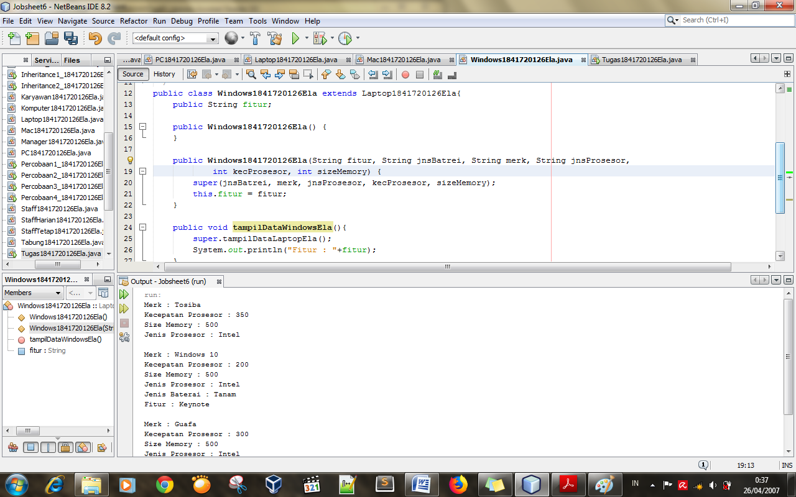

# Laporan Praktikum 6 -Inheritance

## Kompetensi

1. Memahami	konsepdasar	inheritance	ataupewarisan.	
2. Mampu membuat suatu subclass	dari suatu superclass	tertentu.	
 3. Mampu mengimplementasikan konsep single	dab multilevel	inheritance.	
  

## Ringkasan Materi

> Inheritance merupakan suatu cara untuk menurunkan suatu class yang lebih umum menjadi suatu class yang lebih spesifik. Inheritance adalah salah satu ciri utama suatu bahasa program yang berorientasi pada objek. ini dari pewarisan adalah sifat reusable dari konsep object oriented. setiap subclass akan mewarisi sifat dari superclass selama bersifat protected ataupun public. 
 
## Percobaan

## Percobaan 1- extends

 link kode program : 
[ClassA1841720126Ela](../../src/6_Inheritance/ClassA1841720126Ela.java)
 link kode program : 
[ClassB1841720126Ela](../../src/6_Inheritance/ClassB1841720126Ela.java)
 link kode program : 
[Percobaan1_1841720126Ela](../../src/6_Inheritance/Percobaan1_1841720126Ela.java)

### Pertanyaan Percobaan 1
1. Pada percobaan 1 diatas program yang dijalankan terjadi error, kemudian perbaiki sehingga program tersebut bisa dijalankan dan tidak error!
Jawab:

2.	Jelaskan apa penyebab program pada percobaan 1 ketika dijalankan terdapat error!
> Jawab:
terjadi error karena tidak di deklarasikan z,y serta pada classB tidak di tambah i extends

## Percobaan 2 - Hak Akses

link kode program : 
[ClassA2_1841720126Ela](../../src/6_Inheritance/ClassA2_1841720126Ela.java)
 link kode program : 
[ClassB2_1841720126Ela](../../src/6_Inheritance/ClassB2_1841720126Ela.java)
 link kode program : 
[Percobaan2_1841720126Ela](../../src/6_Inheritance/Percobaan2_1841720126Ela.java)

## Pertanyaan percobaan 2

1.	Pada percobaan 2 diatas program yang dijalankan terjadi error, kemudian perbaiki sehingga program tersebut bisa dijalankan dan tidak error!
jawab : 

2. Jelaskan apa penyebab program pada percobaan 2  ketika dijalankan terdapat error! 
> Jawab : Karena pada percobaan pertama atribut nya bertipe private. 
 

## Percobaan 3- Super

link kode program : 
[Bangun1841720126Ela](../../src/6_Inheritance/Bangun1841720126Ela.java)
 link kode program : 
[Tabung1841720126Ela](../../src/6_Inheritance/Tabung1841720126Ela.java)
 link kode program : 
[Percobaan3_1841720126Ela](../../src/6_Inheritance/Percobaan3_1841720126Ela.java)

### Pertanyaan Percobaan 3

1. Jelaskan fungsi “super” pada potongan program berikut di class Tabung! 
> Jawab : Untuk mempresentasikan objek dari suatu kelas. 
2. Jelaskan fungsi “super” dan “this” pada potongan program berikut di class Tabung! 
> Jawab : 
Fungsinya untuk mengambil nilai dari kelas induk , sedangkan This untuk mempresentasikan object class itu sendiri. 
3. Jelaskan mengapa pada class Tabung tidak dideklarasikan atribut “phi” dan “r” tetapi class tersebut dapat mengakses atribut tersebut! 
> Jawab : Karena kelas Tabung mengambil nilai objek dari kelas Bangun. 

## Percobaan 4- Super contsructor

link kode program : 
[ClassA4_1841720126Ela](../../src/6_Inheritance/ClassA4_1841720126Ela.java)
 link kode program : 
[ClassB4_1841720126Ela](../../src/6_Inheritance/ClassB4_1841720126Ela.java)
link kode program : 
[ClassC4_1841720126Ela](../../src/6_Inheritance/ClassC4_1841720126Ela.java)
 link kode program : 
[Percobaan4_1841720126Ela](../../src/6_Inheritance/Percobaan4_1841720126Ela.java)

## Pertanyaan Percobaan 4

1. Pada percobaan 4 sebutkan mana class yang termasuk superclass dan subclass, kemudian jelaskan alasannya!
> Jawab : Super Class : ClassA  SubClass : ClassB , ClassC  Karena pada ClassB dan ClassC kita ketikkan extends untuk mempresentasikan nilai dari induk Class 
2. Ubahlah isi konstruktor default ClassC seperti berikut: 
Tambahkan kata super() di baris Pertama dalam konstruktor defaultnya. Coba jalankan kembali class Percobaan4 dan terlihat tidak ada perbedaan dari hasil outputnya! 
Jawab : 

3. Ublah isi konstruktor default ClassC seperti berikut: 
Ketika mengubah posisi super() dibaris kedua dalam kontruktor defaultnya dan terlihat ada error. Kemudian kembalikan super() kebaris pertama seperti sebelumnya, maka errornya akan hilang. Perhatikan hasil keluaran ketika class Percobaan4 dijalankan. Kenapa bisa tampil output seperti berikut pada saat instansiasi objek test dari class ClassC. 
> Jawab : Karena urutan konstrakter di awal i dari ClassA (superclass) isi dari Classa di tampilkan kemudian ClassB yang mana Di mana kita tambahkan Extends untuk memanggil fungsi dari kelas lain isi dari ClassB di tampilkan , kemudian pada ClassC di ulangi seperti yang ada di ClassC dan isi dari ClassC di tampilkan atau di jalakankan . 

4. Apakah fungsi super() pada potongan program dibawah ini di ClassC! 
 
Jawab : Digunakan untuk memanggil method ternetu dari kelas induk. 

## Percobaan 5

link kode program : 
[Karyawan1841720126Ela](../../src/6_Inheritance/Karyawan1841720126Ela.java)
 link kode program : 
[Manager1841720126Ela](../../src/6_Inheritance/Manager1841720126Ela.java)
link kode program : 
[Staff1841720126Ela](../../src/6_Inheritance/Staff1841720126Ela.java)
 link kode program : 
[Inheritance1_1841720126Ela](../../src/6_Inheritance/Inheritance1_1841720126Ela.java)

### Pertanyaan Percobaan 5

1. Sebutkan class mana yang termasuk super class dan sub class dari percobaan 1 diatas! 
> Jawab : Super Class   : Karyawan Sub Class : Staff, Manager, dengan mengetikkan extends pada classnya dan di ikut i super classnya Karyawan 
 
2. Kata kunci apakah yang digunakan untuk menurunkan suatu class ke class yang lain? 
> Jawab : Extends. 
 
3. Perhatikan kode program pada class Manager, atribut apa saja yang dimiliki oleh class tersebut? Sebutkan atribut mana saja yang diwarisi dari class Karyawan! 
> Jawab : Pada ClassManager terdapat attribut : int Tunjagan  Attribut pada class Kariyawan : Gaji , yang mana nanti akan di turunkan menjadi Tunjagan pada Class Manager. 
 
4. Jelaskan kata kunci super pada potongan program dibawah ini yang terdapat pada class Manager! 
> Jawab : Untuk mewakil i dari kelas induknya yaitu Gaji , sedangkan tunjagan mewakil i kelas Manager. 
 
5. Program pada percobaan 1 diatas termasuk dalam jenis inheritance apa? Jelaskan alasannya! 
> Jawab : Multilevel Inheritance: Suatu sub class yang menjadi parent class untuk class lainnya. 
 

## Percobaan 6 

link kode program :
[StaffTetap1841720126Ela](../../src/6_Inheritance/StaffTetap1841720126Ela.java)
link kode program : 
[StaffHarian1841720126Ela](../../src/6_Inheritance/StaffHarian1841720126Ela.java)
 link kode program : 
[Inheritance2_1841720126Ela](../../src/6_Inheritance/Inheritance2_1841720126Ela.java)

### Pertanyaan Percobaan 6 

1. Berdasarkan class diatas manakah yang termasuk single inheritance dan mana yang termasuk multilevel inheritance? 
> Jawab : Single Inheritance : Pada Percobaan 1 ClassA (Class B mewakili Class B , Class Tabung mewakili Class Tabung) Multilavel inheritance : pada Percobaan4 (Class B,C mewakili Class A, Class Manager, Staff mewakili Class Karyawan, Staffharian, Stafftetap mewakili Class Staff)  
 
2. Perhatikan kode program class StaffTetap dan StaffHarian, atribut apa saja yang dimiliki oleh class tersebut? Sebutkan atribut mana saja yang diwarisi dari class Staff! 
> Jawab : Attribut Class StaffHarian = jumlah jam kerja yang mana attribut ini diwarisi oleh class karyawan (potongan) 
Attribut Class StaffTetap = golongan , asuransi yang mana attribut ini diwarisi oleh class karyawan (lembur) 
 
3. Apakah fungsi potongan program berikut pada class StaffHarian 
> Jawab : 
untuk memanggil nilai dari dari variabel yang ada di dalam class induk (super class) 
 
4. Apakah fungsi potongan program berikut pada class StaffHarian 
> Jawab : Karena pada method tampilDatastaff(); menggunakan kata kunci super untuk mengambil nilai dari variable yang ada di jalam sub class 
 
5. Perhatikan kode program dibawah ini yang terdapat pada class StaffTetap Terlihat dipotongan program diatas atribut gaji, lembur dan potongan dapat diakses langsung. Kenapa hal ini bisa terjadi dan bagaimana class StaffTetap memiliki atribut gaji, lembur, dan potongan padahal dalam class tersebut tidak dideklarasikan atribut gaji, lembur, dan potongan? 
> Jawab :  
Karena pada class StaffTetap kita menggunakan extands untuk memanggil isi yang terdapat di dalam Class Staf yang mana isinya atribut gaji, lembur, dan potongan. 

## Tugas

link kode program :
[PC1841720126Ela](../../src/6_Inheritance/PC1841720126Ela.java)
link kode program : 
[Laptop1841720126Ela](../../src/6_Inheritance/Laptop1841720126Ela.java)
 link kode program : 
[Mac1841720126Ela](../../src/6_Inheritance/Mac1841720126Ela.java)
link kode program : 
[Windows1841720126Ela](../../src/6_Inheritance/Windows1841720126Ela.java)
 link kode program : 
[Tugas1841720126Ela](../../src/6_Inheritance/Tugas1841720126Ela.java)

## Kesimpulan

dalam pratikum ini, telah dipelajari konsep  Memahami konsep dasar inheritance atau pewarisan. Mampu membuat suatu subclass dari suatu superclass	tertentu dan Mampu mengimplementasikan konsep single dan multilevel	inheritance. 

## Pernyataan Diri

Saya menyatakan isi tugas, kode program, dan laporan praktikum ini dibuat oleh saya sendiri. Saya tidak melakukan plagiasi, kecurangan, menyalin/menggandakan milik orang lain.

Jika saya melakukan plagiasi, kecurangan, atau melanggar hak kekayaan intelektual, saya siap untuk mendapat sanksi atau hukuman sesuai peraturan perundang-undangan yang berlaku.

Ttd,

***(Ela Widya Lestari)***
