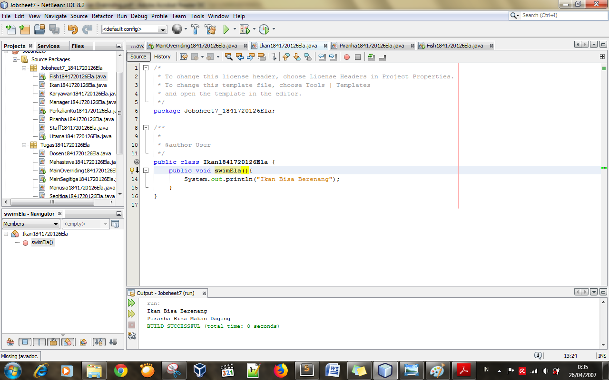

# Laporan Praktikum #7 - Overloading dan Overriding

## Kompetensi

1. Memahami konsep Overloading dan Overriding.
2. Memahami perbedaan Overloading dan Overriding.
3. Ketetapatan dalam mengidentifikasi method overloading dan overriding
4. Mengimplementasi method overloading dan overriding.

## Ringkasan Materi

Overloading adalah kembali method nama yang sama pada suatu class. Tujuannya dapat memudahkan penggunaan atau pemanggilan methed dengan fungsionalitas yang mirip.

Overriding adlah subclass yang berusaha memodifikasi tingkah laku yang diwarisi dari superclass.
## Percobaan

### Percobaan 1

Untuk kasus contoh berikut terdapat tigas class, yaitu karyawan, manager, dan staff. class karyawan merupakan cuperclass dari manager dan staff dimana subclass manager dan staff memiliki method untuk menghitung gaji yang berbeda.

link kode program : 
[Karyawan1841720126Ela](../../src/7_Overriding_dan_Overloading/Karyawan1841720126Ela.java)
link kode program : 
[Manager1841720126Ela](../../src/7_Overriding_dan_Overloading/Manager1841720126Ela.java)
link kode program : 
[Staff1841720126Ela](../../src/7_Overriding_dan_Overloading/Staff1841720126Ela.java)
link kode program : 
[Utama1841720126Ela](../../src/7_Overriding_dan_Overloading/Utama1841720126Ela.java)

## Latihan 

4.1 Dari source coding diatas terletak dimanakah overloading ?
> jawab : 

4.2 Jika terdapat overloading ada berapa jumlah parameter yag berbeda.
> jawab : ada 1 parameter yang berbeda yaiti int c.

link kode program : 
[PerkalianKu1841720126Ela](../../src/7_Overriding_dan_Overloading/PerkalianKu1841720126Ela.java)

4.3 Dari source coding diatas terletak dimanakah overloading?
> jawab : 

4.4 Jika terdapat overloading ada berapa tipe parameter yang berbeda ?
> jawab : terdapat empat parameter berbeda yaitu int a, int b, doublr a, double b.

link kode program : 
[Ikan1841720126Ela1841720126Ela](../../src/7_Overriding_dan_Overloading/Ikan1841720126Ela1841720126Ela.java)
link kode program : 
[Piranha1841720126Ela](../../src/7_Overriding_dan_Overloading/Piranha1841720126Ela.java)
link kode program : 
[Fish1841720126Ela](../../src/7_Overriding_dan_Overloading/Fish1841720126Ela.java)

4.5 Dari source coding diatas terletak dimanakah overriding ? 
> jawab : 

4.6 Jabarkan apabila sourcoding diatas jika terdapat overriding? 
> jawab : Deklarasi method pada subclass Piranha1841720126Ela sama dengan method superclass Ikan1841720126Ela

## Tugas

### 5.1 Overloading

link kode program : 
[Segitiga1841720126Ela](../../src/7_Overriding_dan_Overloading/Segitiga1841720126Ela.java)
link kode program : 
[MainSegetiga1841720126Ela](../../src/7_Overriding_dan_Overloading/MainSegitiga1841720126Ela.java)

### Overriding

link kode program : 
[Manusia1841720126Ela](../../src/7_Overriding_dan_Overloading/Manusia1841720126Ela.java)
link kode program : 
[Dosen1841720126Ela](../../src/7_Overriding_dan_Overloading/Dosen1841720126Ela.java)
link kode program : 
[Mahasiswa1841720126Ela](../../src/7_Overriding_dan_Overloading/Mahasiswa1841720126Ela.java)
link kode program : 
[MainOverriding1841720126Ela](../../src/7_Overriding_dan_Overloading/MainOverriding1841720126Ela.java)

## Kesimpulan

dalam pratikum ini kita dapat mengetahui mengenal dan memahami konsep, oerbedaan , mengidentifikasi dan mengimplementasikan method overloading dan overriding..

## Pernyataan Diri

Saya menyatakan isi tugas, kode program, dan laporan praktikum ini dibuat oleh saya sendiri. Saya tidak melakukan plagiasi, kecurangan, menyalin/menggandakan milik orang lain.

Jika saya melakukan plagiasi, kecurangan, atau melanggar hak kekayaan intelektual, saya siap untuk mendapat sanksi atau hukuman sesuai peraturan perundang-undangan yang berlaku.

Ttd,

***(Ela Widya Lestari)***
